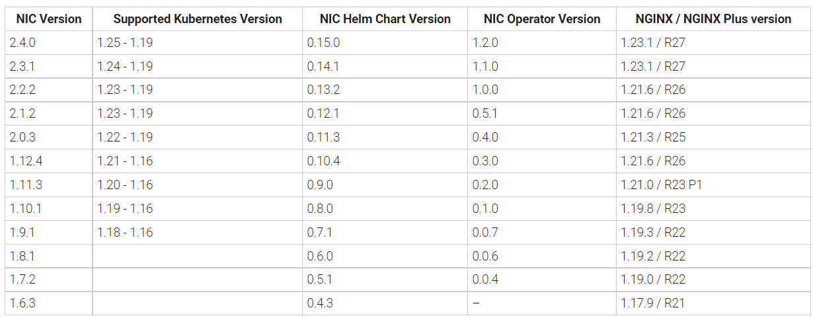
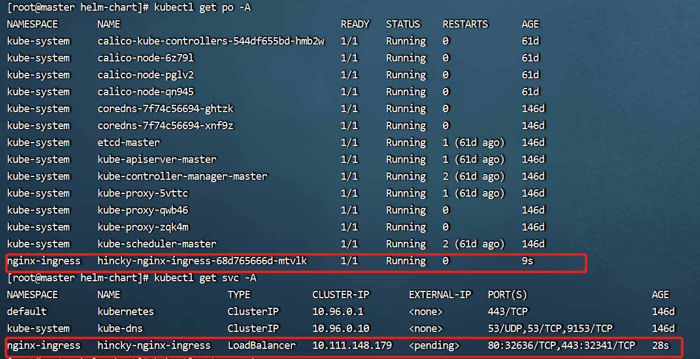

# 安装nginx ingress controller

## 对应好版本

[nginx ingress controller官网地址](https://docs.nginx.com/nginx-ingress-controller/)

下图给出了NIC和k8s的版本匹配关系图



[其他NIC版本参考官网github](https://github.com/nginxinc/kubernetes-ingress/releases)

## helm安装NIC

> 本文介绍的是helm的方式安装

[更多安装方式参考官网地址](https://docs.nginx.com/nginx-ingress-controller/installation/)

将项目克隆到本地，注意**对应好版本**，笔者的k8s集群是`1.24`，所以对应安装`2.3.1`的NIC即可

```bash
git clone https://github.com/nginxinc/kubernetes-ingress.git --branch v2.3.1

cd kubernetes-ingress/deployments/helm-chart
```

添加chart

```bash
helm repo add nginx-stable https://helm.nginx.com/stable
helm repo update
```

## 安装chart

创建命名空间，不然就安装到默认命名空间去了

```bash
kubectl create ns nginx-ingress
```

有了chart资源后，就能安装nginx了

- 通过helm仓库安装
```bash
helm install hincky nginx-stable/nginx-ingress -n nginx-ingress
```
好了之后就能根据ns查看了



## nginx命令

|命令|说明|
|:---:|:---:|
|nginx ||
|||
