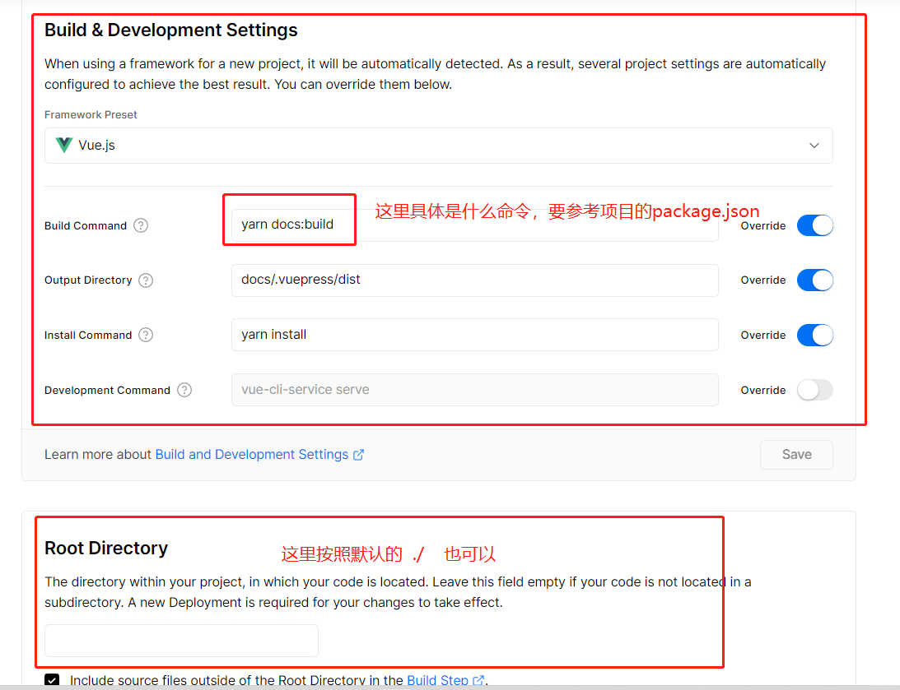
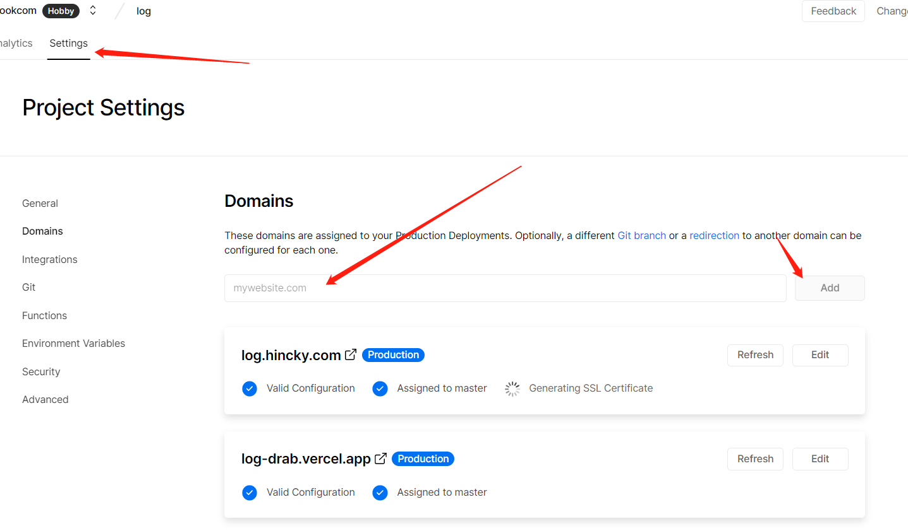

## 介绍

有了vercel之后之后，部署前端项目，尤其个人博客项目，可以完全脱离服务器了。

要做的就是写好代码并提交即可。

vercel会自动拉取最新提交的代码并进行构建和部署

[vercel官网地址](https://vercel.com)

## 导入github项目

github授权之后，就可以选择授权过的项目，交给vercel进行部署

## vercel配置

配置好了之后，部署即可

### 域名配置

dns解析类型为CNAME，其余的解析配置按照vercel提供的配置即可 

dns弄好了之后，vercel会自动添加ssl证书。

然后就可以访问啦~~

