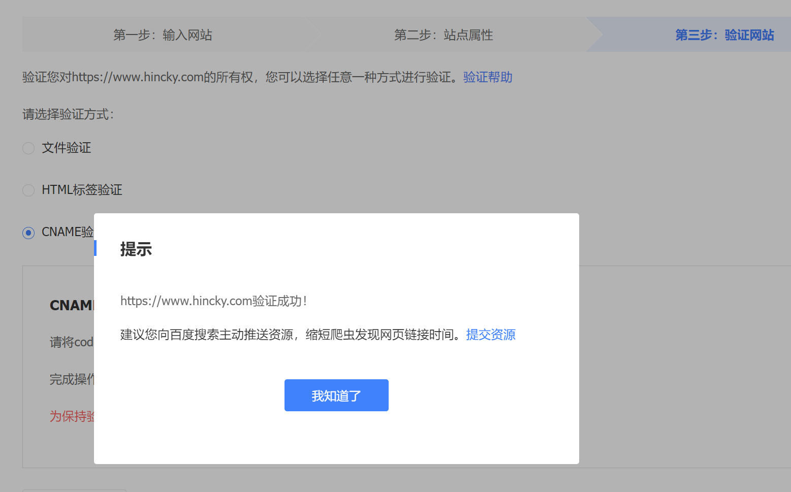

为了缩短百度搜索爬虫爬取我们站点的时间，从而实现seo目的。因此我们要将站点域名加入到百度里面，还要主动向百度推送资源

## 添加站点到百度

[百度站点管理网站](https://ziyuan.baidu.com/site/siteverify?id=1023436931#/)

选择“站点管理”，然后添加网站。

验证了站点的所有权，推荐使用CNAME验证方式，直接将验证码作为子域名解析到百度的域名即可。

验证成功之后，效果如图

接着就开始设置推送资源的方式

## 提交资源

