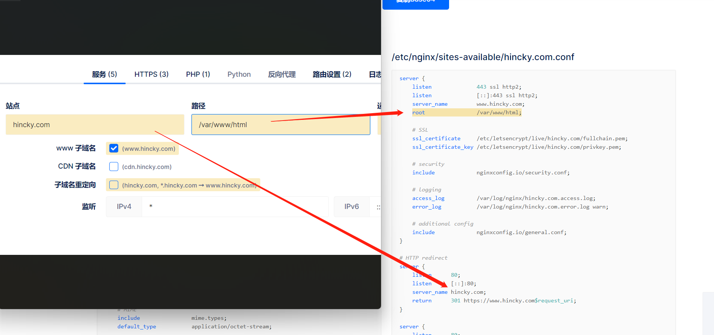

## 服务器环境准备

### 安装nginx

```bash
yum install -y nginx 
systemctl enable nginx && systemctl restart nginx
```

### 安装certbot

```bash
yum install -y certbot
yum install -y python-certbot-nginx  #二选一
#yum install -y python3-certbot-nginx 
```

## 配置nginx

[nginx Config在线配置官网](https://www.digitalocean.com/community/tools/nginx?global.app.lang=zhCN)

这个网站的强大之处就是可视化配置多个域名的nginx配置文件，妈妈再也不用担心我配不好nginx啦

一次可以配置多个站点，输入要配置的域名即可。下方如实时生成配置文件，效果如下图



比如，我是用nginx直接部署vue项目，那么我的步骤就是：
1. `yarn docs:build`构建好项目的静态文件
2. 设置访问域名的nginx配置（ssl证书，静态资源的访问路径）
3. 在服务器上应用nginx配置，并更新nginx
4. 将项目的静态文件，上传或拷贝到nginx配置指定的静态资源访问路径
5. 不出意外就可以用访问啦

下面介绍nginxConfig的一些配置选项
### 站点配置


### nginx全局配置


