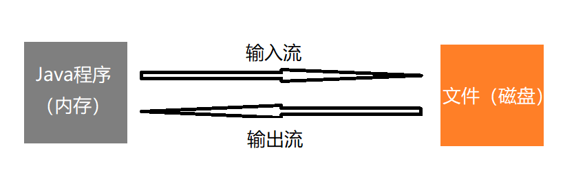

## 介绍

IO流：
- 文件
- IO流原理以及流的分类
- 输入流
    - InputStream
        - FileInputStream
        - BufferedInputStream
        - ObjectInputStream
    - Reader
        - FileReader
        - BufferedReader
        - InputStreamReader
- 输出流
    - OutputStream
    - Writer
- Properties类

## 文件

文件就是保存数据的地方

文件在程序中是以流的形式来操作的



流：数据在数据源（文件）和程序（内存）之间经历的路径

## 文件操作

### 创建文件

- new File(String pathname)             根据路径构建一个File对象
- new File(File parent, String child)   根据父目录文件+子路径构建
- new File(String parent, String child) 根据父路径+子路径构建
- createNewFile()                       前三种获取到路径后，加上这个方法创建文件 

前三种只是在内存中新建了一个file对象，磁盘中还没有实际的文件创建；所以要执行createNewFile()方法，将内存的file对象写入到磁盘中

```java
psvm(){
    public void create03(){
        String parentPath = "e:\\";
        String fileName = "new3.txt";
        File file = new File(parentPath,fileName);

        try{
            file.createNewFile();
            sout("success");
        } catch (IOException e){
            e.printStackTrace();
        }

    }
}
```

### 获取文件信息

getName,getAbsolutePath,getParent,length,exists,isFile,isDirectory

