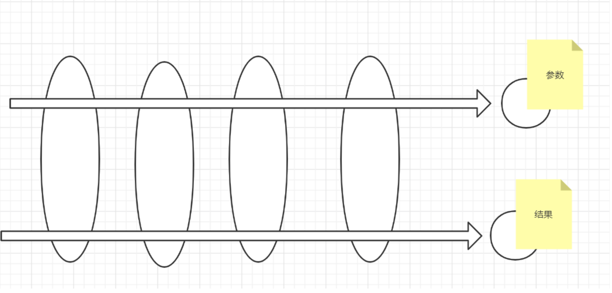
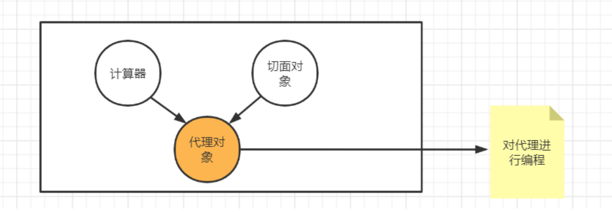

# AOP面向切面编程

AOP也是以IoC为基础，AOP是面向切面编程，抽象化的面向对象。

将与业务功能无关的公共方能抽取成一个切面来实现其它功能与业务功能的解耦。
多用于：打印日志，事务，权限处理

<!-- more -->
比如一个应用的业务功能和打印日志的功能耦合

要通过抽取切面的方式，将打印日志抽取出来，进行统一的切面操作。


做到核心业务和非业务代码的解耦合



实现AOP步骤：
1. 引入Aspect依赖
2. 写好业务接口
3. 写好业务实现类，并用`@Component`注解，将其注入到IoC容器里

4. 写好切面类：
- 用`@Component`注解，将其注入到IoC容器里
- 用`@Aspect`注解，声明这是一个切面对象
5. 使用joinpoint，连接实现类和切面对象
6. 使用joinpoint，获取方法名

7. 通过`@Before`注解，要将写好的切面对象映射到目标实体类的特定方法上
- 作用是：目标方法执行之前，调用切面对象的方法 


## 创建业务接口

编写业务接口
```java
package com.hincky.aop;

public class Calimpl implements Cal{
    @Override
    public int add(int num1, int num2) {
        int result = num1 + num2;
        return result;
    }
    @Override
    public int sub(int num1, int num2) {
        int result = num1 - num2;
        return result;
    }
}
```

## 创建业务的实现类

创建了业务的实现类之后，要添加`@Component`注解，将它注入到IoC容器里面

```java
@Component
public class Calimpl implements Cal{
    @Override
    public int add(int num1, int num2) {
        int result = num1 + num2;
        return result;
    }
    @Override
    public int sub(int num1, int num2) {
        int result = num1 - num2;
        return result;
    }
}
```

## 创建切面对象

1. 用`@Component`注解，将它注入到IoC容器里面;用`@Aspect`注解，声明为一个切面对象
2. 通过joinpoint，连接 实现类和切面对象；即切面对象通过joinpoint就是获取目标类的方法名，参数信息
3. 在切面对象方法上用`@Before`或`@AfterReturning`注解映射目标类里的方法；即相当于将目标类里的方法偷取出来做统一切面操作
4. joinpoint 不能获取结果信息，因此方法的结果要通过设置Object类型参数+设置`@AfterReturning`注解中的returning属性来映射获取


```java
@Component  //第一步：添加添加`@Component`注解，将它注入到IoC容器里面
@Aspect
public class LoggerAspect {

    //通过Before里面的execution表达式来映射目标对象里面的方法
    //如果映射里面所有方法就用.*     参数就用两个点表示
    @Before("execution(public int com.hincky.aop.Calimpl.*(..))")
    public void before(JoinPoint joinPoint){
        //获取方法名
        String name = joinPoint.getSignature().getName();
        //获取方法的参数
        System.out.println(name+"方法的参数是："+ Arrays.toString(joinPoint.getArgs()));
    }
    
    //结果return了之后，才去获取结果
    //写法和上面统一
    @AfterReturning(value = "execution(public int com.hincky.aop.Calimpl.*(..))",returning = "result")
    public void afterReturning(JoinPoint joinPoint,Object result){
        //获取方法名
        String name = joinPoint.getSignature().getName();
        //获取方法的结果，joinporint不能获取方法的结果
        System.out.println(name+"方法的结果是："+ result);
    }
    //joinpoint拿不到结果，所以获取结果的步骤：
    /**
     * 1. 在方法参数中，定义一个Object result；当方法结果返回之后，将结果和这个新定义的参数映射起来
     * 映射步骤
     * 2. 用value描述方法：value = "execution(public int com.hincky.aop.Calimpl.*(..))"
     * 3. 用一个属性returning来绑定新参数result：returning = "result"
     */
}
```

## 使用AOP
- 配置包的扫描路径
- 配置自动生成AOP代理

### XML使用方式

resources文件夹下创建aop.xml文件
```xml
<?xml version="1.0" encoding="UTF-8"?>
<beans
        xmlns="http://www.springframework.org/schema/beans"
        xmlns:xsi="http://www.w3.org/2001/XMLSchema-instance"
        xmlns:context="http://www.springframework.org/schema/context"
        xmlns:aop="http://www.springframework.org/schema/aop"
        xmlns:p="http://www.springframework.org/schema/p"
        xsi:schemaLocation="http://www.springframework.org/schema/beans
    http://www.springframework.org/schema/beans/spring-beans.xsd
    http://www.springframework.org/schema/context
    http://www.springframework.org/schema/context/spring-context.xsd
    http://www.springframework.org/schema/aop
    http://www.springframework.org/schema/aop/spring-aop-4.3.xsd">

<!--    自动扫描包-->
    <context:component-scan base-package="com.hincky.aop"></context:component-scan>
<!--    自动生成代理-->
    <aop:aspectj-autoproxy></aop:aspectj-autoproxy>

</beans>
```

测试类验证

```java
public class AOPTest {
    public static void main(String[] args) {
        ApplicationContext context = new ClassPathXmlApplicationContext("aop.xml");
        Cal cal = context.getBean(Cal.class);
        System.out.println(cal.add(3, 4));
        System.out.println(cal.sub(3, 4));
    }
}
```

### 设置AOP代理

后期再补充。。。


## 总结

实现AOP步骤：
业务接口和业务实现类（目标类）
1. 引入Aspect依赖
2. 写好业务接口
3. 写好业务实现类，并用`@Component`注解，将其注入到IoC容器里

编写切面类对象
1. 写好切面类：
- 用`@Component`注解，将其注入到IoC容器里
- 用`@Aspect`注解，声明这是一个切面对象
2. 使用joinpoint，连接实现类和切面对象；即切面对象通过joinpoint就是获取目标类的方法名，参数信息
3. 在切面对象方法上用`@Before`或`@AfterReturning`注解映射目标类里的方法；即相当于将目标类里的方法偷取出来做统一切面操作
- `@Before`注解作用是：目标方法执行之前，调用切面对象的方法 
- `@AfterReturning`注解作用是：目标方法返回结果之后，调用切面对象的方法
4. joinpoint 不能获取结果信息，因此方法的结果要通过设置Object类型参数+设置`@AfterReturning`注解中的returning属性来映射获取

使用AOP
总体来说有xml配置和注解两种方式去完成以下两个步骤
1. 配置包的扫描路径
2. 配置自动生成AOP代理

:::warning
一个切面对象只能和一个目标类绑定成为一个代理。

也就是说如果只有一个切面对象，而业务接口对应有多个实现类的话，在自动生成代理阶段，程序无法将切面对象绑定到具体的实体类而出错！
:::