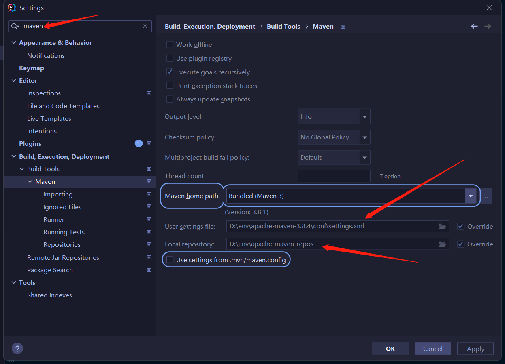
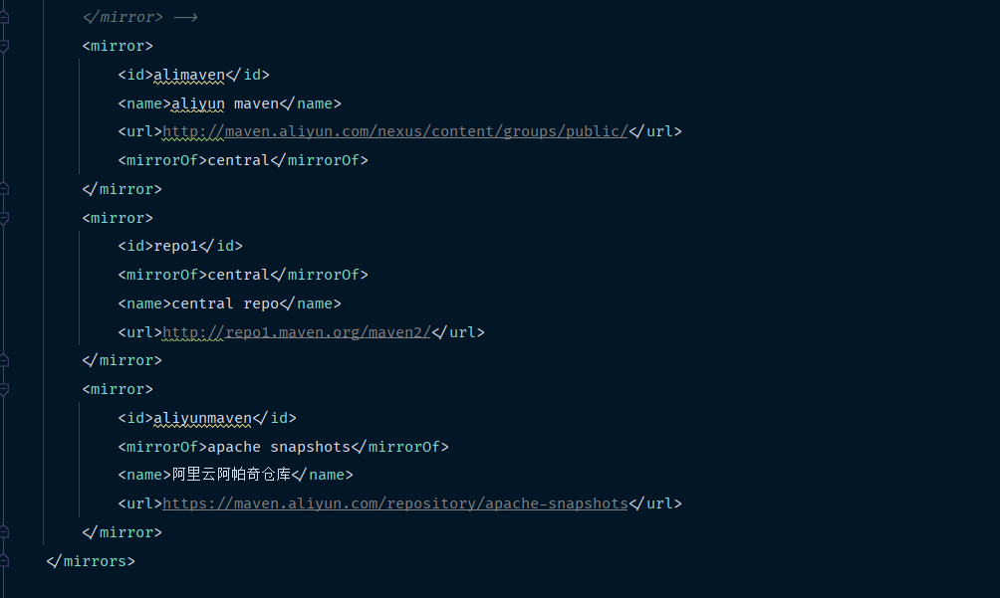

# mybatis介绍
- mybatis是一款优秀的持久层框架
- 免除了几乎所有的JDBC代码以及设置参数和获取结果集的工作

[官网地址](https://mybatis.org/mybatis-3/zh/#)

## mybatis简单操作实践

流程步骤：
- 添加mybatis配置
- 定义数据类
- 定义数据类的接口
- 接口名称alt+enter去到xml文件里面，添加mapper映射的sql语句
- 测试类中调用接口，验证sql结果

## idea创建maven工程
- 选择maven路径

- 配置阿里云镜像加速

