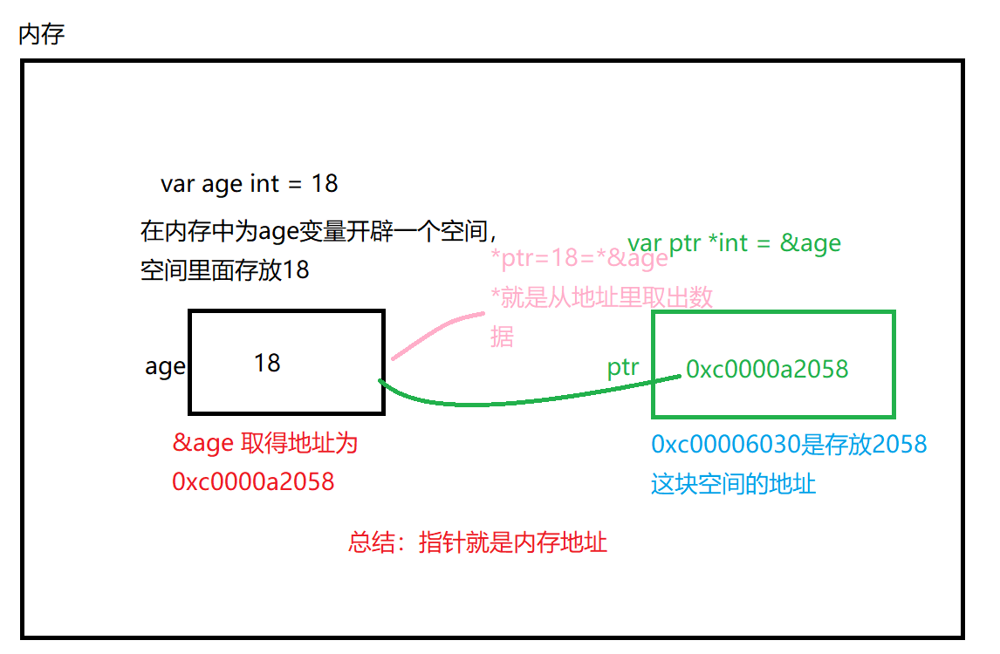

Go没有多态，继承，重载；Go 所具有的是结构体的概念，可以将一些方法和结构体关联。

## 定义结构体

其实就是相当于java中定义一个类

```go
type Person struct {
    Name String
    Age int
}
```

## 声明和初始化

```go
// 基本用法
hincky := Person{ //逗号 , 是必需的。没有它的话，编译器就会报错。
    Name := "hincky",
    Age := 25,
}

// 只定义一个，另一个单独获取并赋值
hincky := Person{Name := "hincky"}
hincky.Age = 25

// 最简单
hincky := Person{"hincky", 25}
```

### 结构体字段

```go
type Person struct {   
    Name    string   
    Age     int   
    Father  *Person 
}
```

### 结构体初始化

```go {7}
hincky := &Person{   // 关于&符号，请看下面指针对应的内容
    Name: "Gohan",   
    Age:  25,   
    Father: &Person {
        Name:   "Goku",     
        Age:    46,     
        Father: nil,   
    }, 
}
```

### 函数参数传递方式

#### 镜像复制

<mark>引用之后做了修改，但是不会影响原来的值</mark>

即这种方式，修改的只是原来值的一个副本

```go
func main() {
  hincky := Person{"hincky", 25}
  Super(hincky)
  fmt.Println(hincky.Age)
}

// Super 修改了原始值 goku 的复制版本，而不是它本身，所以，Super 中的修改并不影响上层调用者。
func Super(p Person) { //镜像复制
	p.Age += 100 //hincky.age的值还是25，而不是125
}
```

#### 指针

这种方式就可以<mark>获取到原来的值</mark>，而不是副本
1. 对于基本数据类型
<mark>&是取地址符</mark>，取出被修饰变量在内存中的地址

```go
var age int = 18
```

2. 对于指针变量
```go
var ptr *int = &age
```
- var 声明一个变量
- ptr 变量的名字
- *int 指向int类型的指针
- &age 是一个地址

3. 通过ptr这个指针（地址）指向这个数据
```go
*ptr   //这样就可以取出&age空间里面的数据了
```


```go 
func main() {
  hincky := &Person{"hincky", 25}
  Super(hincky)
  fmt.Println(hincky.Age)  // 这里就为125了
}

func Super(p *Person) { //利用指针，来获取原来的值
	p.Age += 100 //hincky.age的原值已被修改为125
}
```

复制一个指针比复制一个复杂的结构的消耗小多了。在 64 位的机器上面，一个指针占据 64 bit 的空间。如果我们有一个包含很多字段的结构，创建它的副本将会是一个很昂贵的操作。指针的真正价值在于能够分享它所指向的值。

所以写代码前，要清楚想让 Super 修改 hincky 的副本（用镜像复制）还是修改共享的 hincky 值本身（用指针）呢？

## 结构体上的函数

```go 
type Person struct {
  Name string
  Age int
}

func (s *Person) Super() {
  s.Age += 100
}
```


## 构造器

```go 
func NewPerson(name string, age int) Person {
  return Person{
    Name: name,
    Age: age,
  }
}
```

### new

```go
hincky := &Person{}   // 尽量多用这一种

// hincky := &Person{
//   Name : "hincky",
//   Age : 25,
// }

//作用等于

hincky = new(Person)

// hincky := new(Person)
// hincky.name = "hincky"
// hincky.power = 25
```
