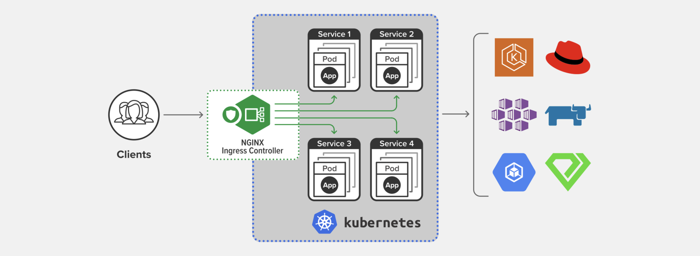
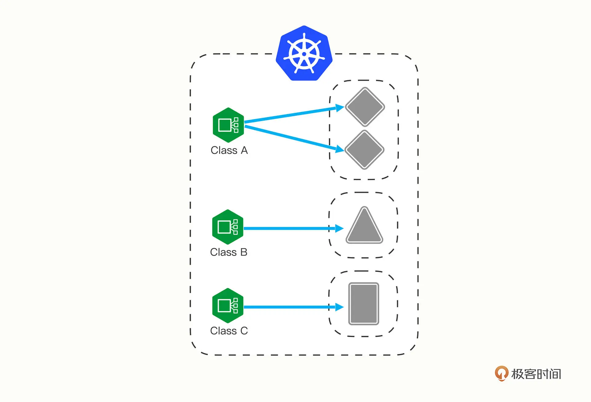
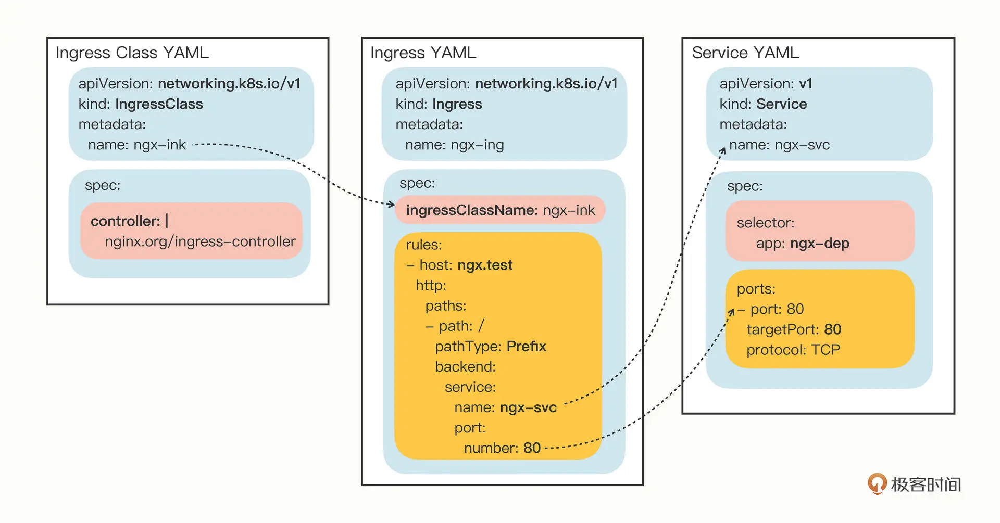
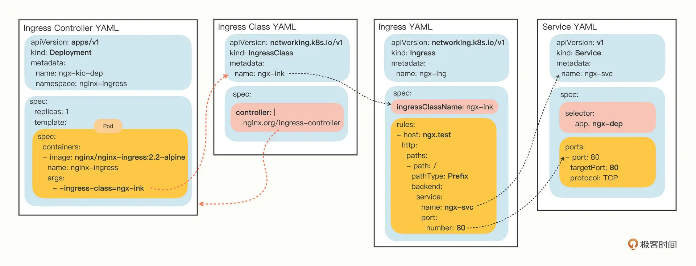

# ingress:集群的流量出入口

> 本节三个重要角色：

- `ingress`
- `ingress class`
- `ingress controller`

## 为什么要有ingress

### 路由访问角度

service适合进群内部的相互访问，如果要对外暴露，只能走两条路：

- `NodePort` 
- `LoadBalancer`

不够灵活，不能根据`url/文件路径/`来定制负载

### 负载角度

由于service本质上是一个由 `kube-proxy` 控制的四层负载均衡，在 `TCP/IP` 协议栈上转发流量，只能够依据 IP 地址和端口号做一些简单的判断和组合：


而跑在七层的 `HTTP/HTTPS` 协议上的，有更多的高级路由条件，比如主机名、URI、请求头、证书等等。

而这些在 `TCP/IP` 网络栈里是根本看不见的，因此`service`并不能完全解决网络流量的管理问题。

### 小结

综合以上两点，所以k8s需要新的API对象：`ingress`，来作为七层的负载均衡

## 为什么要有ingress controller

类比`Service`，`Ingress` 也只是一些 HTTP 路由规则（用 `HTTP/HTTPS` 协议定义流量应该如何分配、转发）的集合，相当于一份静态的描述文件。

`Ingress Controller`才是真正把这些规则在集群里实施运行，它的作用就相当于 `Service` 的 `kube-proxy`，能够读取、应用 `Ingress` 规则，处理、调度流量。

> 下表是k8s中API对象的对应关系

|规则|读取，调度，应用规则|
|:---:|:---|
|service|kube-proxy|
|ingress|ingress controller|

然而因为`Ingress Controller`要做的事情太多，与上层业务联系太密切。

所以k8s没有将`Ingress Controller`内置成API对象，反而把`Ingress Controller`的实现交给社区

其中最富盛名的就是下图的`Nginx Ingress Controller`



nic可以将ingress对象转化成Nginx的配置文件并使之生效

## 为什么要有 ingress class

随着 `Ingress` 规则太多，都交给一个 `Ingress Controller` 处理会让它不堪重负:
1. 多个 Ingress 对象没有很好的逻辑分组方式，管理和维护成本很高；
2. 集群里有不同的租户，他们对 Ingress 的需求差异很大甚至有冲突，无法部署在同一个 Ingress Controller 上。

基于缓存思维：“一层不行就再加一层” 的原则

于是提出`Ingress Class`的概念，夹在前面两者之间，作为解耦强绑定的中间层。

K8s 用户可以转向管理 `Ingress Class`，用它来定义不同的业务逻辑分组，简化 `Ingress` 规则的复杂度。比如说，我们可以用 `Ingress Class A` 处理博客流量、`Ingress Class B` 处理短视频流量、`Ingress Class C` 处理购物流量。



## 如何用yaml编写ingress，ingress class

像之前学习 `Deployment`、`Service` 对象一样，首先用命令 `kubectl api-resources` 查看它们的基本信息

```bash
kubectl api-resources | grep ingress
```

打印结果

```bash
[root@master deployment]# kubectl api-resources | grep ingress
NAME                SHORTNAMES      APIVERSION          NAMESPACED     KIND
ingressclasses                   networking.k8s.io/v1     false       IngressClass
ingresses               ing      networking.k8s.io/v1     true        Ingress
```
`ingress`的简写是`ing`，两者的版本都是`networking.k8s.io/v1`

没有`Ingress Controller`是因为它和其他两个对象不太一样

它不只是描述文件，是一个要实际干活、处理流量的应用程序。

而应用程序在 K8s 里早就有对象来管理了，那就是 `Deployment` 和 `DaemonSet`

所以我们只需要再学习 `Ingress` 和 `Ingress Class` 的用法就可以了。

### ingress.yml

#### 创建模板yaml

使用 `kubectl create` 来创建模板文件，需要加两个参数：
- --class，指定 Ingress 从属的 Ingress Class 对象。
- --rule，指定路由规则，基本形式是“URI=Service”，也就是说是访问 HTTP 路径就转发到对应的 Service 对象，再由 Service 对象转发给后端的 Pod。

```bash
export out="--dry-run=client -o yaml"
kubectl create ing ngx-ing --rule="ngx.test/=ngx-svc:80" --class=ngx-ink $out
```

```yaml
apiVersion: networking.k8s.io/v1
kind: Ingress
metadata:
  name: ngx-ing
spec:
  ingressClassName: ngx-ink  #对应参数 --class=ngx-ink 
  rules:
  - host: ngx.test  #对应参数 --rule="ngx.test/=ngx-svc:80"
    http:
      paths:
      - path: /
        pathType: Exact
        backend:
          service:
            name: ngx-svc  # --rule="ngx.test/=ngx-svc:80"
            port:
              number: 80   # --rule="ngx.test/=ngx-svc:80"
```


### ingress-class.yml

`ingress class`只是起到联系 `Ingress` 和 `Ingress Controller` 的作用。

所以它的定义非常简单，在“spec”里只有一个必需的字段“controller”，表示要使用哪个 Ingress Controller，具体的名字就要看实现文档了。

比如nginx的`IngressClass`，就要在`spec`里面标明`nginx.org/ingress-controller`
```yaml
apiVersion: networking.k8s.io/v1
kind: IngressClass
metadata:
  name: ngx-ink

spec:
  controller: nginx.org/ingress-controller
```

下图是`Ingress`，`ingress class`，`service` yaml文件的对应关系  



由于`ingress class`的yaml文件比较小，因此将其和`ingress`的yaml合并为单个`ingress.yml`方便使用

```yaml
apiVersion: networking.k8s.io/v1
kind: Ingress
metadata:
  name: ngx-ing
spec:
  ingressClassName: ngx-ink  #对应参数 --class=ngx-ink 
  rules:
  - host: ngx.test  #对应参数 --rule="ngx.test/=ngx-svc:80"
    http:
      paths:
      - path: /
        pathType: Exact
        backend:
          service:
            name: ngx-svc  # --rule="ngx.test/=ngx-svc:80"
            port:
              number: 80   # --rule="ngx.test/=ngx-svc:80"
---
apiVersion: networking.k8s.io/v1
kind: IngressClass
metadata:
  name: ngx-ink
spec:
  controller: nginx.org/ingress-controller
---
```

## 在k8s中使用ingress，ingress class


## 在k8s中使用ingress controller

ic本质上是一个pod，所以支持deployment和daemonSet两种方式部署到k8s上面。

所以部署步骤
1. 给ic创建namespace
2. deployment部署ic的pod
3. service对外暴露ic的pod，以供访问

最后贴出ic，ingress，ingressClass，service的对应关系图



