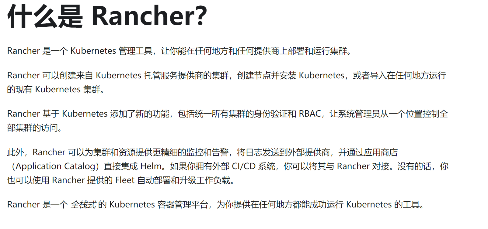
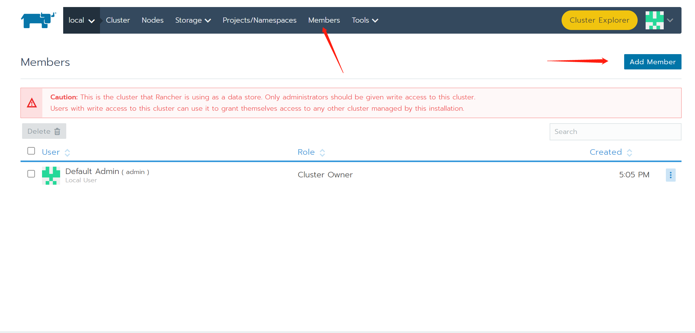
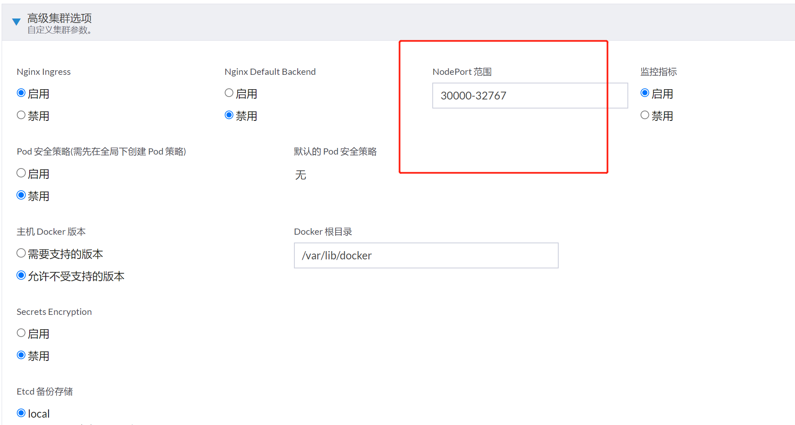
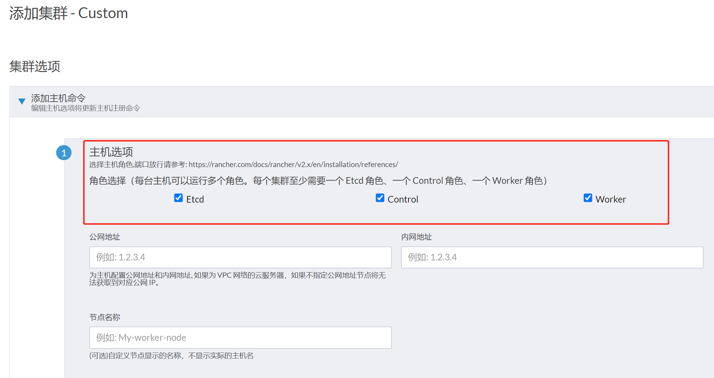

Rancher 是一个 Kubernetes 管理工具，让你能在任何地方和任何提供商上部署和运行集群。

Rancher是一个开源的企业级容器管理平台。通过Rancher，企业再也不必自己使用一系列的开源软件去从头搭建容器服务平台。Rancher提供了在生产环境中使用的管理Docker和Kubernetes的全栈化容器部署与管理平台。



> 简单来说：rancher>k8s>docker

一般来说是rancher从k8s集群独立出来，单独部署rancher。实现解耦，即rancher类似一个网关入口

# 部署rancher

推荐使用容器的方式部署，与业务系统解耦

因此第一步要安装容器，这里选择docker

## 安装docker

### 依赖

```sh
yum install wget expect vim net-tools ntp bash-completion ipvsadm ipset jq iptables conntrack sysstat libseccomp curl git yum-utils device-mapper-persistent-data lvm2 -y
```

### 安装以及换源

```bash
 
yum-config-manager --add-repo https://mirrors.aliyun.com/docker-ce/linux/centos/docker-ce.repo

#dnf repo-pkgs docker-ce-stable list

# yum list docker-ce --showduplicates | sort -r #查看docker的版本
# yum -y erase podman buildah   #centos8需要删除podman

#例如安装19.03.9版本
yum -y install docker-ce-19.03.9-3.el7 


sudo mkdir -p /etc/docker
sudo tee /etc/docker/daemon.json <<-'EOF'
{
  "registry-mirrors": ["https://mvl6n9ol.mirror.aliyuncs.com"]
}
EOF

systemctl daemon-reload ; systemctl restart docker;systemctl enable --now docker.service

```

### 验证docker

```sh
docker version
docker info
```
 

## 配置时间同步

::: tip
如果是云服务器，时间同步这一步可以跳过
:::

确认时间服务已经安装

yum -y install chrony

vim /etc/chrony.conf

cat > /etc/chrony.conf &#x3c;&#x3c;-'EOF'
pool 192.168.5.150 iburst
driftfile /var/lib/chrony/drift
makestep 1.0 3
rtcsync
allow 192.168.5.0/24
local stratum 10
keyfile /etc/chrony.keys
leapsectz right/UTC
logdir /var/log/chrony
EOF

启动时间服务:
systemctl restart chronyd.service --now
 

设置完时区后，强制同步下系统时钟： chronyc -a makestep

查看时间同步源： chronyc sources -v

查看时间同步源状态： chronyc sourcestats -v

重启依赖于系统时间的服务

systemctl restart rsyslog ; systemctl restart crond


系统日志保存方式设置:

原因：centos7以后，引导方式改为了systemd，所以会有两个日志系统同时工作只保留一个日志（journald）的方法 设置rsyslogd 和 systemd journald

## 持久化保存日志的目录


```
mkdir /var/log/journal
mkdir /etc/systemd/journald.conf.d
cat  >  /etc/systemd/journald.conf.d/99-prophet.conf <<-'EOF'
[Journal]
#持久化保存到磁盘
Storage=persistent
# 压缩历史日志
Compress=yes
SyncIntervalSec=5m
RateLimitInterval=30s
RateLimitBurst=1000
# 最大占用空间10G
SystemMaxUse=10G
# 单日志文件最大200M
SystemMaxFileSize=200M
# 日志保存时间 2 周
MaxRetentionSec=2week
# 不将日志转发到 syslog
ForwardToSyslog=no
EOF
```

#重启journald配置
systemctl restart systemd-journald
 

## 设置主机名

主机ip与域名的对应关系 设置主机名

 

cat > /etc/hosts << EOF
127.0.0.1   localhost localhost.localdomain localhost4 localhost4.localdomain4
::1         localhost localhost.localdomain localhost6 localhost6.localdomain6
43.138.161.91 rancher
43.139.67.186 master-01
43.139.43.21 node-02
43.139.116.230 node-03
EOF

 

## 关闭防火墙 SELinux 与swap交换空间

并关闭swap三台主机 并安装docker  本例安装版本为docker-ce-19.03.9-3.el7  设置好时间服务器

sed -ri 's/.*swap.*/#&/' /etc/fstab

 

## 下载runcher

https://hub.docker.com/rancher

在master端执行如下命令

docker pull rancher/rancher:v2.5.2-linux-amd64

dockerhub 点击overview进入官方站点

docker pull rancher/rancher:v2.7-head

## 运行rancher

将rancher的数据挂载到一个目录下，作为数据持久化

```sh
# docker run -d --privileged -p 80:80 -p 443:443 --restart=always --name rancher-v2.5.2 rancher/rancher:v2.5.2-linux-amd64

# 或者以下这样

mkdir -p /mnt/d/rancher_data

docker run -d --privileged -p 80:80 -p 443:443 -v /mnt/d/rancher_data:/var/lib/rancher/ --restart=always --name rancher-v2.5.2 rancher/rancher:v2.5.2-linux-amd64

docker run -d --privileged -p 80:80 -p 443:443 -v /mnt/d/rancher_data:/var/lib/rancher/ --restart=always --name rancher-v2.7 rancher/rancher:v2.7-head
```
 
安装最新版本的rancher时必须指定--privileged参数。简单来说使用了改参数后，容器内的root拥有真正的root权限。

在启动时如果需要持久化racher应用数据，可以挂载一个目录。-v /mnt/d/rancher_data:/var/lib/rancher/ 这样rancher的应用数据就存储在了 /mnt/d/rancher_data 目录中。根据官方的建议，rancher的运行内存要求至少4GB内存。运行安装命令后，浏览器访问 https:&#x3c;主机域名或IP>


浏览器登录 设置密码与rul访问路径，并切换为中文环境


## 新建用户

首先配置一个标准用户:



用户权限：
- 管理员：所有权限，十分危险，分配需谨慎
- 受限管理员：除了local集群不能访问，其他集群都可以访问和设置
- 标准用户：创建新的集群，并管理他自己的集群和项目
- 基础：只能查看和访问


 
## 配置新的集群

设置好名称和用户之后，进入高级集群选项

开放好安全组或者防火墙的端口




然后是配置集群的节点主机配置，然后拷贝下面的docker命令到要部署的主机里面执行


多master的意义就是，一个master宕了，另外一个master可以独立工作；为了容错

而keepalive的目的是自动切换


创建master节点:

sudo docker run -d --privileged --restart=unless-stopped --net=host -v /etc/kubernetes:/etc/kubernetes -v /var/run:/var/run rancher/rancher-agent:v2.5.2 --server https://192.168.110.147 --token cl78vbfnv96vfc88plrmq5c295tptzq5k7ff5pv8l28vhp75s4wqh4 --ca-checksum 699da741eb03976a3bb89db64c73e290fa05273cc5e6a26f9083ae0b714c7919 --etcd --controlplane --worker

 

添加主机

sudo docker run -d --privileged --restart=unless-stopped --net=host -v /etc/kubernetes:/etc/kubernetes -v /var/run:/var/run rancher/rancher-agent:v2.5.2 --server https://192.168.110.147 --token 5pbfhpfczc2m26pfzkncv68xsg74sthqn5mc2qqzcz8q92wp75fnkr --ca-checksum 23d95b968d947319dc078eb7568ff28b210c0e534b34eb8b7cffd82bf8c10433 --worker


