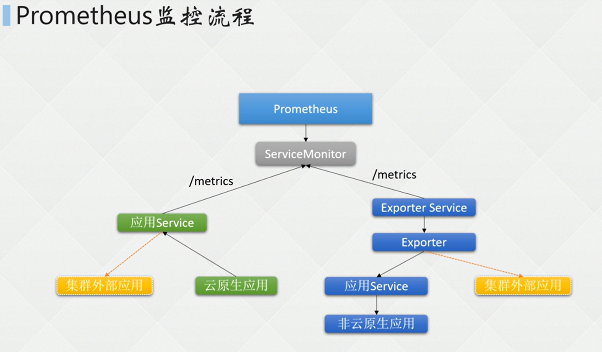

## 云原生应用

因为很多云原生应用都原生支持对外暴露<mark>/metrics</mark>监控信息的接口

可以先通过`ps aux | grep node`找出node_exporter相关的监控进程

再利用`netstat -lntp | grep 9100` 9100是上面查出来的端口信息

最后访问 `127.0.0.1:9100/metrics` 去查看监控代理所暴露的监控信息

## 非云原生应用

对于非云原生应用，由于没有自带的/metrics，所以要通过按照<mark>exporter</mark>作为监控代理

查看宿主机所有链接信息
netstat -lantup

获取监控信息的方法与上面类似

## 监控

两种配置方式
- prometheus.yaml：
    - 二进制安装
    - 容器安装
    - helm
- ServiceMonitor：
    - helm
    - Prometheus Operator
    - Kube-Prometheus 

### ServiceMonitor监控配置

::: tip
前提：安装方式是 Kube-Prometheus 
:::

声明ip，port，还有监控指标之类的配置，但是监控目标增多之后管理就十分困难

所以Prometheus通过<mark>ServiceMonitor</mark>来管理

k8s查看ServiceMonitor配置项
``` sh
kubectl get servicemonitor -n monitoring
```

以yaml格式输出具体某个配置项
``` sh
kubectl get servicemonitor -n monitoring node-exporter -o yaml
```

留意好标签匹配器selector里面的标签匹配规则

通过标签查询监控的负载均衡
``` sh 
kubectl get svc -n monitoring -l app.kubernetes.io/component=exporter
```

#### ServiceMonitor模板

Prometheus通过这个监控配置去发现监控目标

``` yml
apiVersion: monitoring.cores.com/v1
kind: ServiceMonitor
metadata:
  labels:
    k8s-app: elasticsearch-exporter
    release: es-exporter
  name: es-exporter-elasticsearch-exporter
  namespace: monitoring
spec:
  endpoints:
  - honorLabels: true   # 是否保留目标标签
    interval: 10s       # 抓取间隔
    path: /metrics
    port: http          
    scheme: http        # 接口的协议
  jobLabels: es-exporter
  namespaceSelector:    # 监控目标Service所在的命名空间
    matchNames:
    - monitoring
  selector:             # 监控目标Service的标签
    matchLabels:
      k8s-app: elasticsearch-exporter
      release: es-exporter
```

### 监控流程




