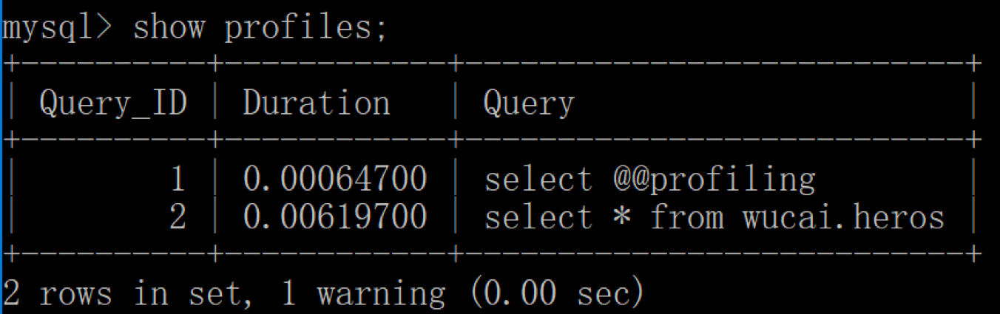
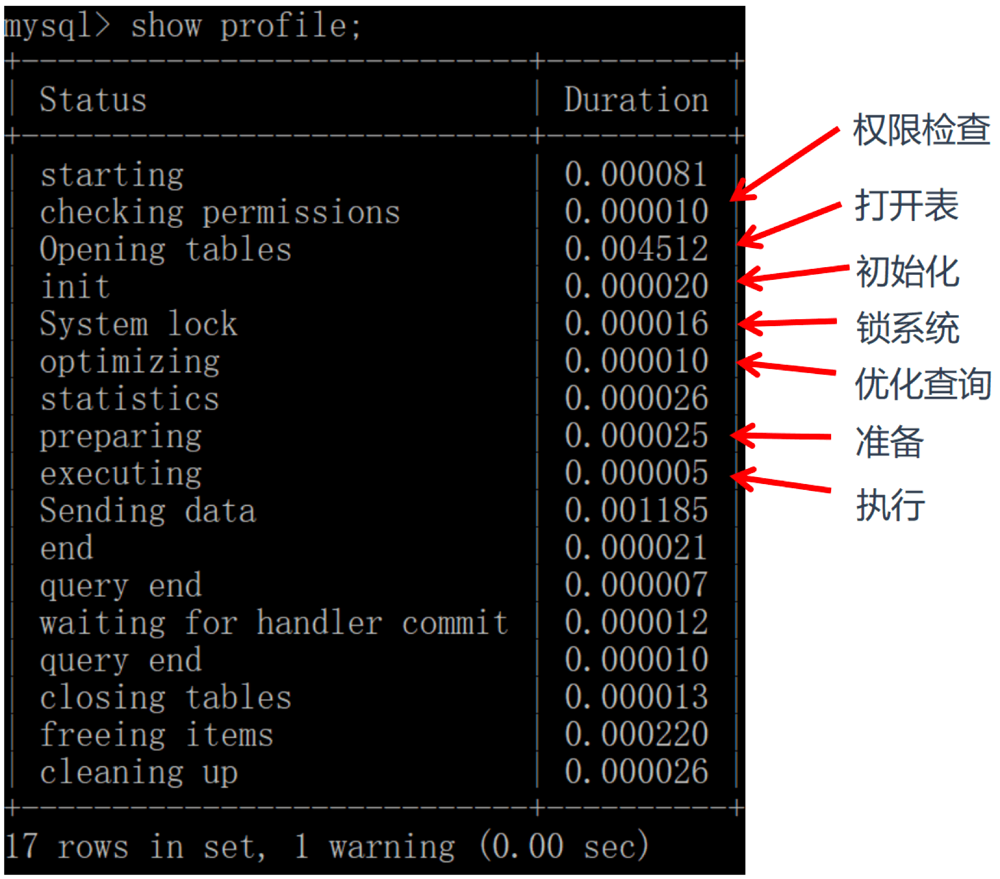

不同的模块中，SQL 执行所使用的资源（时间）是怎样的?

## 开启profiling

查询是否开启profiling  profiling=0代表关闭，1代表开启

```sql
select @@profiling;
-- 若没有开启，则利用下面语句开启
set profiling=1;
```

### 执行sql查询

执行一个 SQL 查询（你可以执行任何一个 SQL 查询）：
```sql
select * from wucai.heros;
```

### 查看profiling日志

查看当前会话所产生的所有 profiles：

```sql
show profiles;
-- 会显示出开启profiling后所有的查询sql，并标号
```



如果要看上一次的sql查询语句执行情况，少一个`s`
```sql
show profile;
-- 下面是查询具体标号的sql执行情况
show profile for query 2;
```



