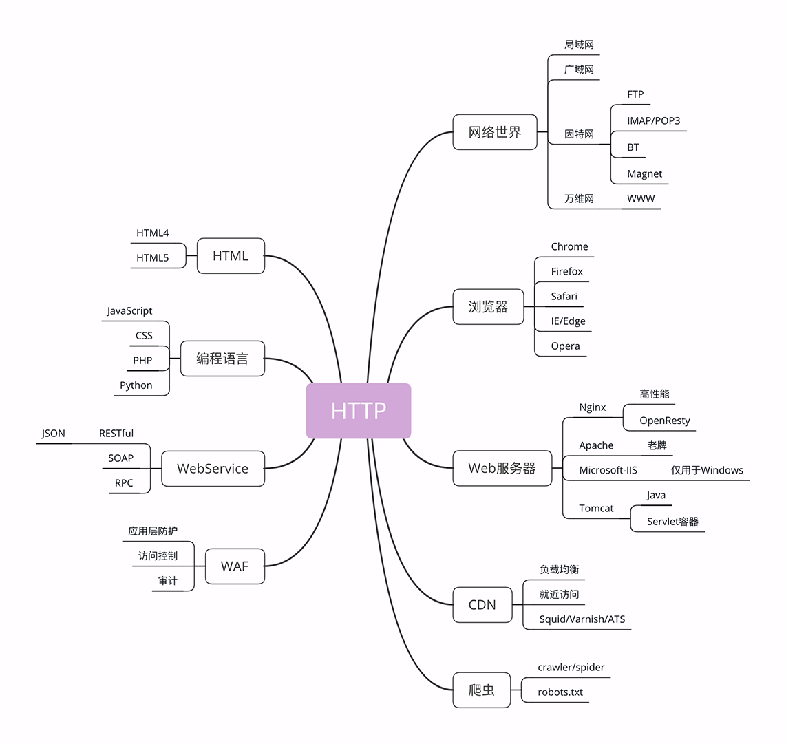
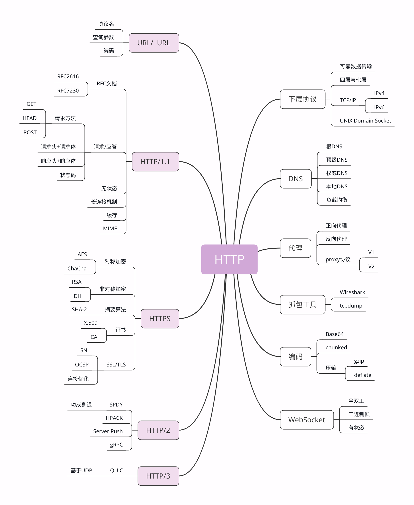

## http协议

区分**请求方**和**应答方**的超文本（图片，文字，音视频）传输协议

一种无状态的，应用层的，以请求/应答方式运行的协议，它使用可扩展的语义和自描述消息格式，与基于网络的超文本信息系统灵活的互动

**前置问题**

- 用 Nginx 搭建 Web 服务器，照着网上的文章配好了，但里面那么多的指令，什么 keepalive、rewrite、proxy_pass 都是怎么回事？为什么要这么配置？
- 用 Python 写爬虫，URI、URL“傻傻分不清”，有时里面还会加一些奇怪的字符，怎么处理才好？
- 都说 HTTP 缓存很有用，可以大幅度提升系统性能，可它是怎么做到的？又应该用在何时何地？
- HTTP 和 HTTPS 是什么关系？还经常听说有 SSL/TLS/SNI/OCSP/ALPN……这么多稀奇古怪的缩写，头都大了，实在是搞不懂。

- 状态码

|状态码|含义|
|:---:|:---:|
|1xx|提示信息，是协议处理的中间状态，实际能够用到的时候很少|
|200|资源访问成功|
|204|响应头后没有 body 数据|
|301|网页url永久重定向|
|302|短暂重定向，抓取新页面但是保留旧url|


- 与http相关的概念

[详情看极客时间](https://time.geekbang.org/column/article/98423)


- 与http相关的协议

[详情看极客时间](https://time.geekbang.org/column/article/98934)



- 四层/七层到底是什么

[详情看极客时间](https://time.geekbang.org/column/article/99286)

### 搭建http实验环境

[详情看极客时间](https://time.geekbang.org/column/article/100124)

## 浏览器发送http请求的过程


1. 服务器暴露80和443等web端口
2. 浏览器送url中取出域名，并根据域名查询DNS服务器获取目的IP地址
3. 浏览器和服务器三次握手建立TCP连接（如果是https还要完成TLS/SSL握手）
4. 浏览器构造HTTP请求，填充上下文和HTTP头部
5. 发起HTTP请求
6. 接收到HTTP响应包体（里面携带HTTP页面）
7. 浏览器解析响应，并在用户界面进行渲染

### HTTP消息格式（基于ABNF语义）


起始行：
- 请求行 `GET / HTTP/1.1`
- 响应行 `HTTP/1.1 200 OK`

headers:

请求体：

示例：
```sh
HTTP-message = start-line *(header-field CRLF) CRLF [message-body]

# * 表示零个或多个 
# CRLF 回车+换行 即必须以CRLF的换行结尾
# [message-body] 可选的message-body

# SP 空格
# HTAB 横向制表符
```


### 上机演示

```sh
telnet www.baidu.com 80
GET /wp-content/plugins/Pure-Highlightjs_1.0/assets/pure-highlight.css?ver=0.1.0 HTTP/1.1
Host: www.baidu.com
```


