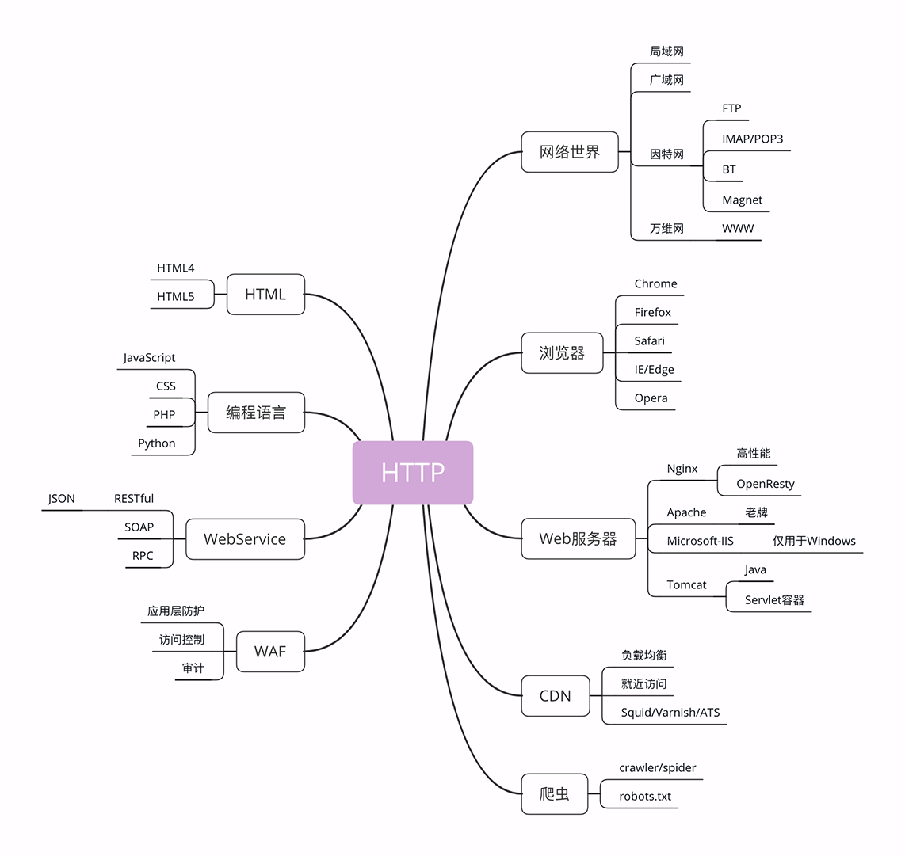
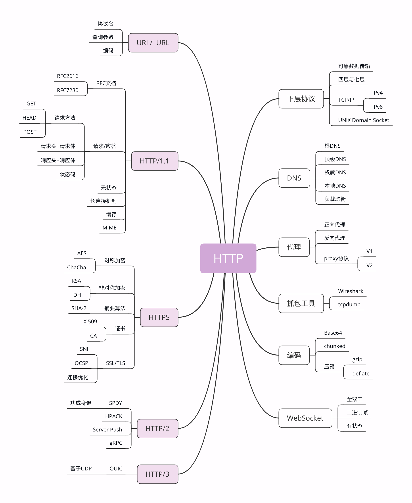

## http协议

区分**请求方**和**应答方**的超文本（图片，文字，音视频）传输协议

**前置问题**

- 用 Nginx 搭建 Web 服务器，照着网上的文章配好了，但里面那么多的指令，什么 keepalive、rewrite、proxy_pass 都是怎么回事？为什么要这么配置？
- 用 Python 写爬虫，URI、URL“傻傻分不清”，有时里面还会加一些奇怪的字符，怎么处理才好？
- 都说 HTTP 缓存很有用，可以大幅度提升系统性能，可它是怎么做到的？又应该用在何时何地？
- HTTP 和 HTTPS 是什么关系？还经常听说有 SSL/TLS/SNI/OCSP/ALPN……这么多稀奇古怪的缩写，头都大了，实在是搞不懂。

## 状态码

|状态码|含义|
|:---:|:---:|
|1xx|提示信息，是协议处理的中间状态，实际能够用到的时候很少|
|200|资源访问成功|
|204|响应头后没有 body 数据|
|301|网页url永久重定向|
|302|短暂重定向，抓取新页面但是保留旧url|

### 与http相关的概念

[详情看极客时间](https://time.geekbang.org/column/article/98423)

### 与http相关的协议

[详情看极客时间](https://time.geekbang.org/column/article/98934)

### 四层/七层到底是什么

[详情看极客时间](https://time.geekbang.org/column/article/99286)

## 搭建http实验环境

[详情看极客时间](https://time.geekbang.org/column/article/100124)

