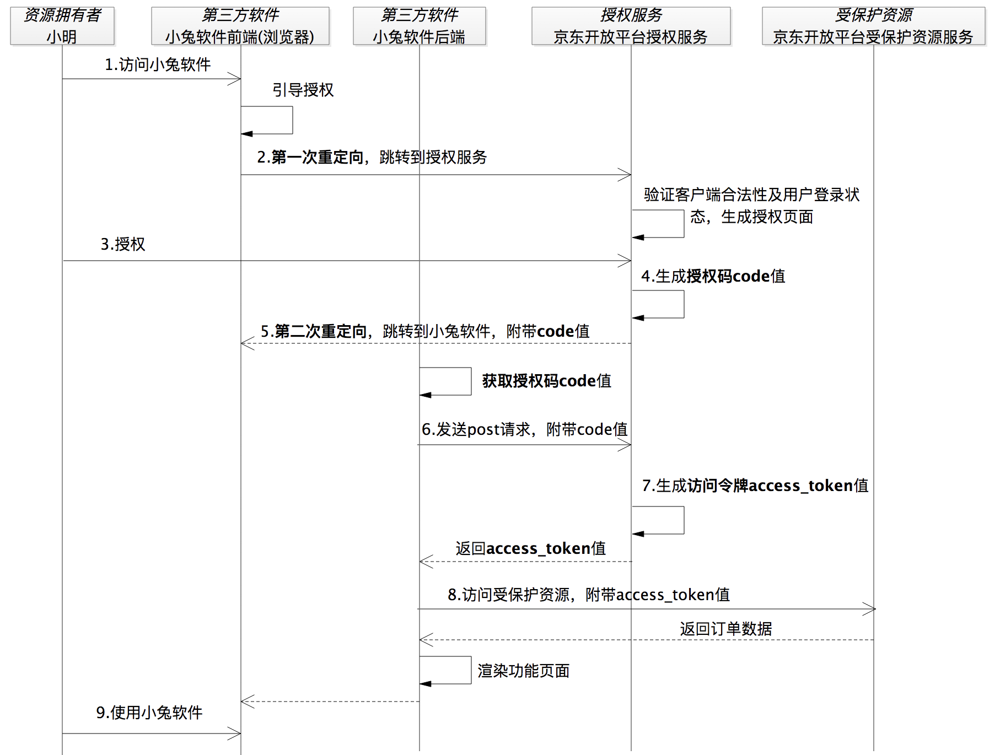
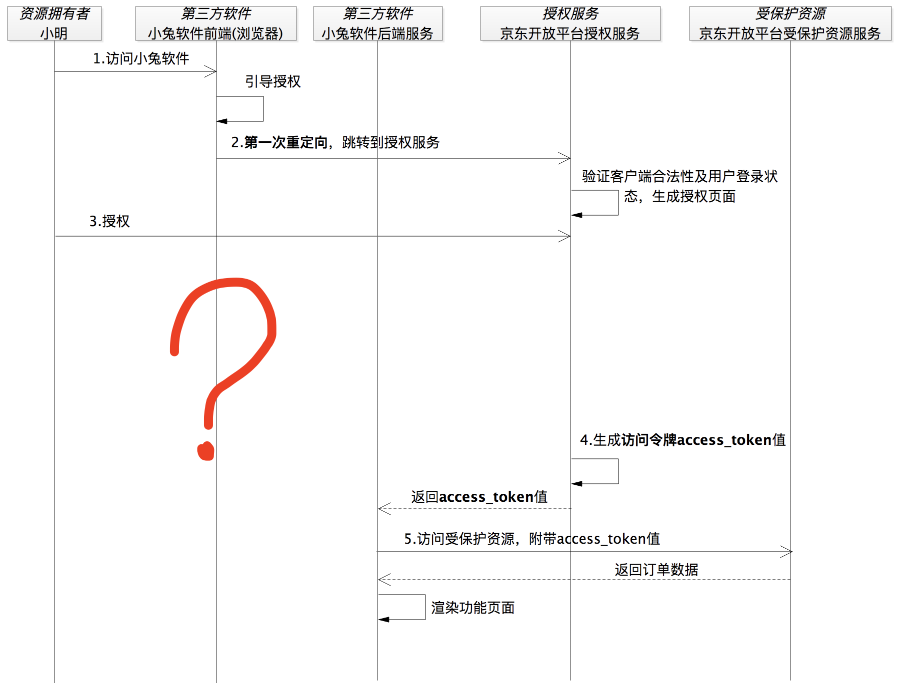

## 参与角色

授权协议：就是保证第三方（软件）只有在获得授权之后，才可以进一步访问授权者的数据。

在 OAuth 2.0 的体系里面有 4 种角色：
- 资源拥有者 
- 第三方 
- 授权服务 
- 受保护资源 

### 为什么要有授权码

通过授权码来获取访问令牌，最终用访问令牌来访问资源

至于为什么不直接返回令牌而要使用授权码这样“多麻烦一步”的原因是：

如果这里直接返回访问令牌，那我们肯定不能使用重定向的方式。因为这样会把安全保密性要求极高的访问令牌暴露在浏览器上，从而将会面临访问令牌失窃的安全风险。显然，这是不能被允许的。

果没有授权码的话，我们就只能把访问令牌发送给第三方软件小兔的后端服务。按照这样的逻辑，上面的流程图就会变成下面这样：

一方面授权码也都有有效期，另外一方面除非再盗取了第三方应用软件的app_id、secret才能成功请求资源。

## Https和Oauth2的区别

HTTPS 和 OAuth 是两个维度的安全，HTTPS解决的信息加密传输，OAuth 解决的是用token来代替用户名和密码传输。

