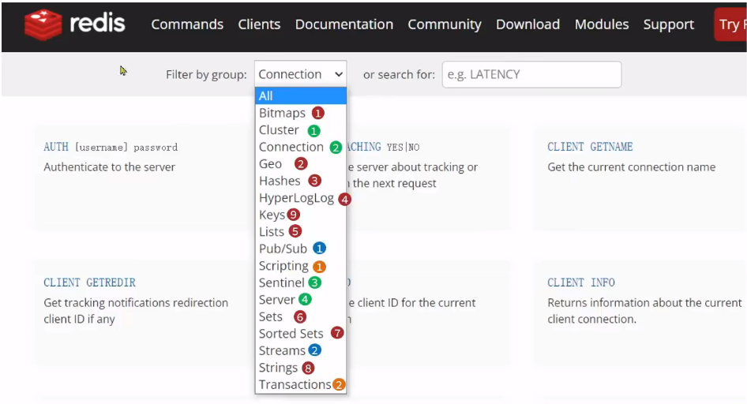

# redis介绍

[B站视频链接](https://www.bilibili.com/video/BV1cr4y1671t/?spm_id_from=333.788.recommend_more_video.0&vd_source=2d16754c593aa46ab0b0e5335e2582fd)

- 9种数据结构
- 两个消息队列
- 4个不同的相关运维操作
- script脚本和事务操作

