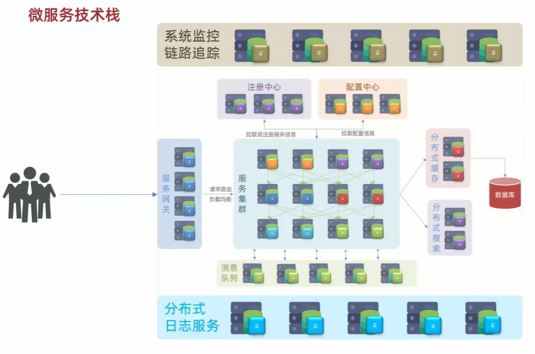
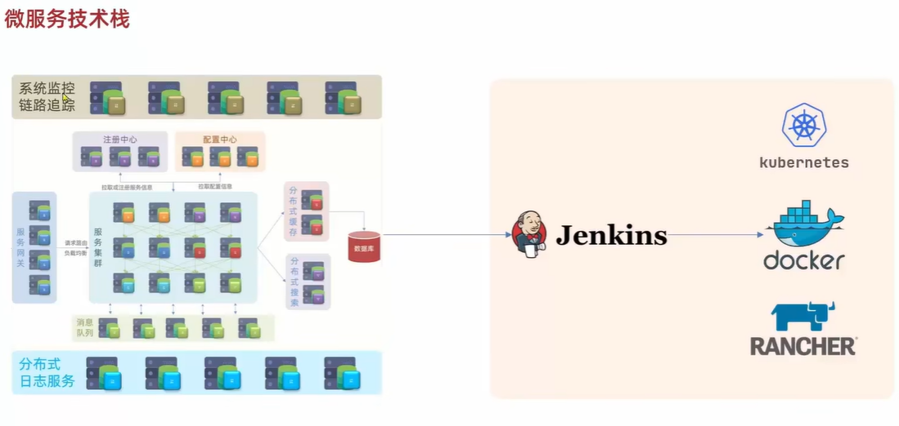
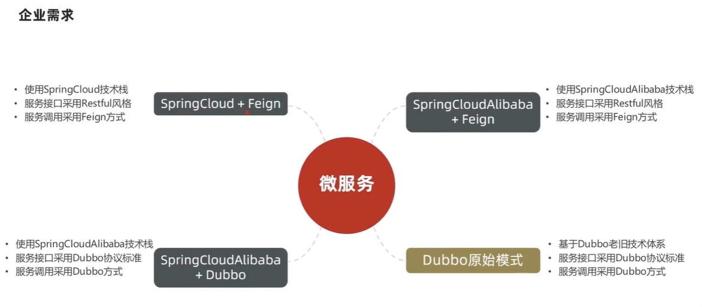

# 微服务介绍
- 微服务技术
- 持续集成

[B站Spring Cloud项目视频地址](https://www.bilibili.com/video/BV1LQ4y127n4/?spm_id_from=333.337.search-card.all.click&vd_source=2d16754c593aa46ab0b0e5335e2582fd)

对传统的应用根据业务功能模块，将单体项目拆分成若干个独立的项目。每个项目完成一部分业务功能，方便独立开发和独立部署。

## 微服务技术

1. 如此多个服务的调用关系十分复杂，因此利用**注册中心**进行统一注册，实现服务注册与发现。
2. 而多个服务的配置也是十分繁琐，因此利用**配置中心**进行统一配置和管理
3. 在访问或者调用微服务时，就要利用**网关**来进行身份校验，负载均衡，最终路由到具体的微服务上，开始处理业务请求
4. 微服务处理业务时访问数据库集群，但在高并发的访问下，需要在微服务和数据库集群之间，加入**缓存集群**。就是将热点数据放入缓存集群里的内存中，提高查询效率。缓存未命中再访问数据库，减缓数据库压力
5. 对于复杂的搜索和数据分析，则利用到**分布式搜索**
6. 利用异步通信的**消息队列**，请求来了之后，上级微服务直接发消息通知下级的微服务后就结束调用了，数据好了之后下级服务再返回。缩短微服务的调用链路（请求-A-B-C 变为 请求-A）
7. 如何排除这么多服务的异常或者问题呢，就通过**分布式日志**来进行统一的存储统计和分析，方便以后复盘
8. **系统监控和链路追踪**可以监控每个服务的状态，一旦出现问题就可以定位到具体的服务或者应用

## 持续集成

jenkins 进行编译，利用docker之类的容器镜像工具打包成镜像，最后通过k8s之类的容器编排来实现自动化部署

## 微服务技术栈对比

||Dubbo|Spring Cloud|Spring Cloud Alibaba|
|:---:|:---:|:---:|:---:|
|注册中心|zookeeper,redis|Eureka,Consul|Nacos,Eureka|
|服务远程调用方式|Dubbo（rpc协议）|Feign（http协议）|Dubbo,Feign|
|配置中心||SpringCloudConfig|Nacos,SpringCloudConfig|
|服务网关||SpringCloudGateway,Zuul|SpringCloudGateway,Zuul|
|服务监控和保护|dubbo-admin,功能弱|Hystrix|Sentinel|

## 企业微服务技术栈平替关系图

按照左上，右上，左下，右下标号为 1234

1可以升级到2，服务的调用方式不变，还是http

4可以升级到3，服务的调用方式不变，还是dubbo

