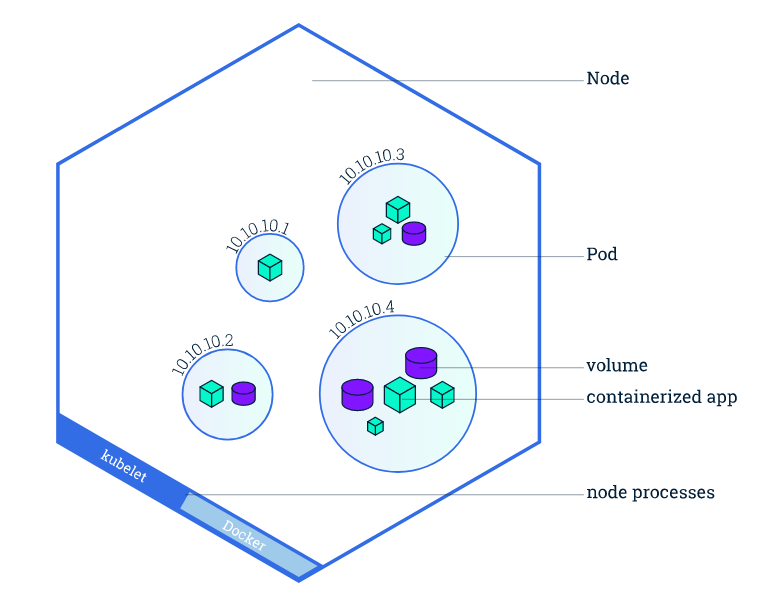
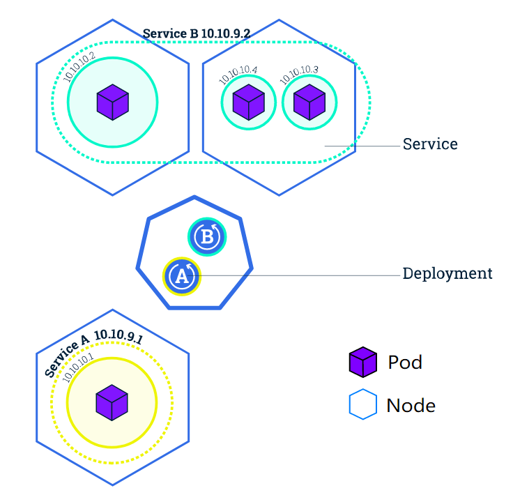

# k8s概念

类比关系表

|k8s组件|云计算系统|
|:---:|:---:|
|container 容器|进程|
|image 镜像| .exe安装包|
|kubernetes|OS 操作系统|
|pod|虚拟机|
|||


## node

- node节点，可以是物理机也可以是私有云公有云的虚拟机。
- 一个node节点能运行多个pod，k8s就是将pod调度到健康的node上面运行。
- 每个node上都有kubelet：管理node，而且是node与master通信的代理
- 每个node上都有容器运行时docker或containerd或rkt

node节点一般分为：
- master管理节点
- worker工作节点

**master**：kube-apiserver、kube-controller-manager和kube-scheduler。负载资源管理，pod调度，弹性伸缩，安全控制，系统监控，纠错等等

**worker**：kubelet，kube-proxy。负责Pod的创建、启动、监控、重启、销毁，以及实现软件模式的负载均衡器。


## Deployment

用于管理pod，deployment的定义文件要有
- 目标pod的定义
- 目标pod要运行的副本数量replicas
- 要监控的目标pod的标签


replicaSet：确保任何时间都有指定数量的pod运行，建议用deployment来管理rs

master通过deployment将特定副本数量应用实例调度到合适节点上运行，当节点关闭或被删除自动调度到其他节点运行实例。

```bash
kubectl create deployment kubernetes-nginx --image=nginx:1.10
```

## pod

- 提供服务的进程，都被包装到相应的pod中，使其成为pod中运行的一个容器。
- 每个pod都运行一个Pause的基础容器，用作共享网络和挂载卷；其他容器都以业务容器，共享pause容器的网络和挂载。



```bash
kubectl get pods
kubectl describe pods
```

## service

- 唯一指定的名称（eg：mysql-server）
- 一个虚拟IP地址（ClusterIp地址）和端口号
- 提供远程服务能力
- 将请求转发到一组容器应用上

service和pod的联系
1. service对应一个或者多个pod，service定义了一组pod的逻辑集
2. 每个pod都贴上标签Label（eg：运行php的pod标签是name=mysql）
3. service定义标签选择器（eg：PHP service标签选择器作用与所有包含name=php的pod）
4. 不是每个pod和它里面运行的容器都能被映射到一个service上，只有提供服务（对内对外都行）的那组pod才会被映射为一个服务。



```bash
kubectl get svc
```

## configMap
说白了就是一个资源的yaml文件

> 是一种API对象，用来将非机密性的数据保存到键值对中。使用时，Pod可以将其用作环境变量、命令行参数或者存储卷中的配置文件。使用ConfigMap可以将你的配置数据和应用程序代码分开。

ConfigMap允许你**将配置文件与镜像文件分离**，以使**容器化的应用程序具有可移植性**。

# k8s应用部署实践

> k8s中所有的对象创建或删除都建**议用配置文件的方式来设置**，避免直接用命令创建或删除

mysql-deploy.yml

```yaml
apiVersion: apps/v1 # API版本
kind: Deployment # 此资源对象的类型，Deployment
metadata:
  labels: # 标签
    app: mysql
  name: mysql # 对象名称，全局唯一
spec: # 此资源对象相关属性定义
  replicas: 1 # 副本数量
  selector: # pod选择器
    matchLabels: 
      app: mysql
  template: # pod模板
    metadata:
      labels: # 指定新建pod的标签，必须和上面的selector匹配
        app: mysql
    spec:
      containers: # 定义容器
      - image: mysql:5.7
        name: mysql
        port:
        - containerPort: 3306
        env:
        - name:MYSQL_ROOT_PASSWORD
          value: "123456"
          
```

```bash
kubectl apply -f mysql-deploy.yml
kubectl get deploy
kubectl get pods

# kubectl delete -f mysql-deploy.yml
```

有了deployment管理创建pod之后，要想访问到pod里面的应用。还要为pod创建对应的service，来将其ip+port暴露出来以供访问

mysql-svc.yml

```yaml
apiVersion: v1 # API版本
kind: Service # 此资源对象的类型，Service
metadata:
  name: mysql # 对象名称，全局唯一
spec: # 此资源对象相关属性定义
  ports: 
    - port: 3306 # 定义了service的虚拟端口
  selector: # pod选择器
    app: mysql
```

```bash
kubectl create -f mysql-svc.yml
kubectl get svc mysql
```


资源整合中，敬请期待！