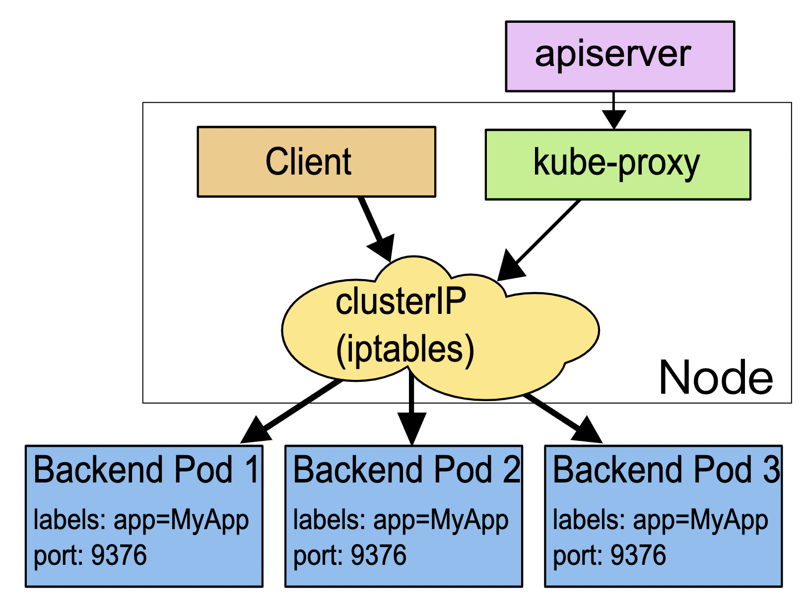

# ingress:集群的流量出入口

> 本节三个重要角色：
- `ingress`
- `ingress class`
- `ingress controller`

## 为什么要有ingress

### 路由访问角度

service适合进群内部的相互访问，如果要对外暴露，只能走两条路：

- `NodePort` 
- `LoadBalancer`

不够灵活，不能根据`url/文件路径/`来定制负载

### 负载角度

由于service本质上是一个由 `kube-proxy` 控制的四层负载均衡，在 `TCP/IP` 协议栈上转发流量，只能够依据 IP 地址和端口号做一些简单的判断和组合：

而跑在七层的 `HTTP/HTTPS` 协议上的，有更多的高级路由条件，比如主机名、URI、请求头、证书等等。

而这些在 `TCP/IP` 网络栈里是根本看不见的，因此`service`并不能完全解决网络流量的管理问题。

> 总结以上两点，所以k8s需要新的api对象：`ingress`，来作为七层的负载均衡

## 为什么要有ingress controller

`Ingress` 也只是一些 HTTP 路由规则（用 `HTTP/HTTPS` 协议定义流量应该如何分配、转发）的集合，相当于一份静态的描述文件。

`Ingress Controller`才是真正把这些规则在集群里实施运行，它的作用就相当于 `Service` 的 `kube-proxy`，能够读取、应用 `Ingress` 规则，处理、调度流量。