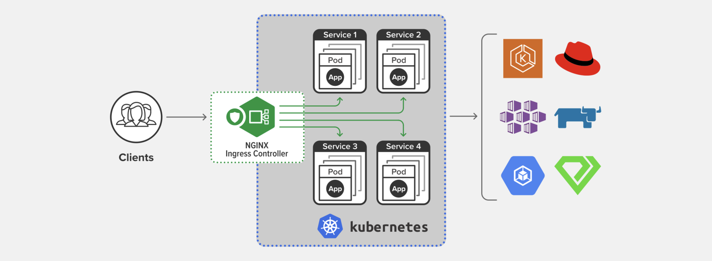
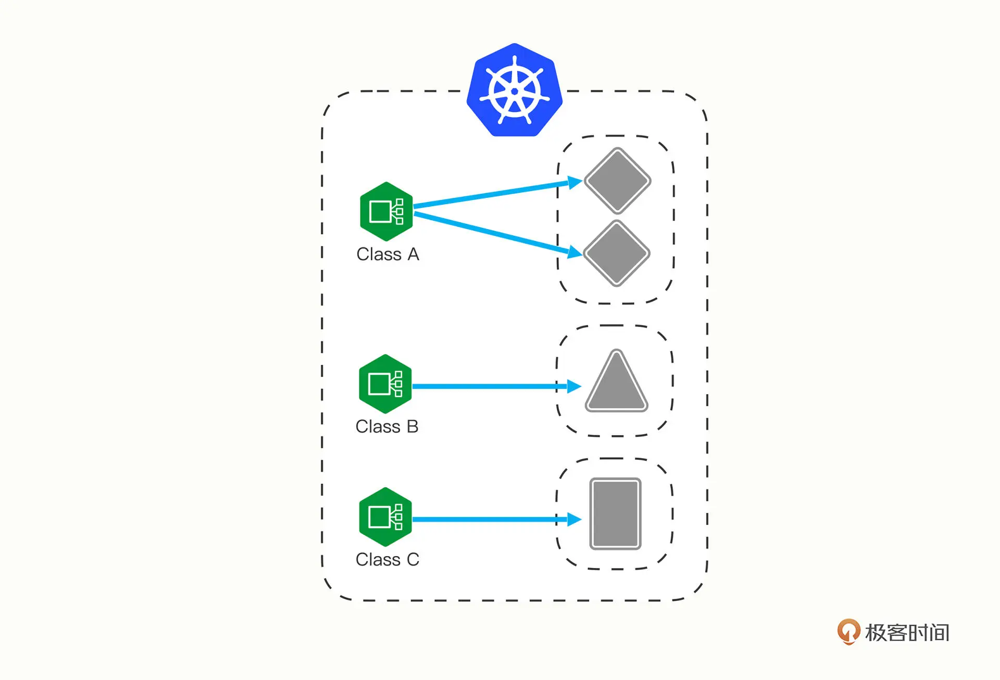

# ingress:集群的流量出入口

> 本节三个重要角色：

- `ingress`
- `ingress class`
- `ingress controller`

## 为什么要有ingress

### 路由访问角度

service适合进群内部的相互访问，如果要对外暴露，只能走两条路：

- `NodePort` 
- `LoadBalancer`

不够灵活，不能根据`url/文件路径/`来定制负载

### 负载角度

由于service本质上是一个由 `kube-proxy` 控制的四层负载均衡，在 `TCP/IP` 协议栈上转发流量，只能够依据 IP 地址和端口号做一些简单的判断和组合：

而跑在七层的 `HTTP/HTTPS` 协议上的，有更多的高级路由条件，比如主机名、URI、请求头、证书等等。

而这些在 `TCP/IP` 网络栈里是根本看不见的，因此`service`并不能完全解决网络流量的管理问题。

### 小结

综合以上两点，所以k8s需要新的API对象：`ingress`，来作为七层的负载均衡

## 为什么要有ingress controller

类比`Service`，`Ingress` 也只是一些 HTTP 路由规则（用 `HTTP/HTTPS` 协议定义流量应该如何分配、转发）的集合，相当于一份静态的描述文件。

`Ingress Controller`才是真正把这些规则在集群里实施运行，它的作用就相当于 `Service` 的 `kube-proxy`，能够读取、应用 `Ingress` 规则，处理、调度流量。

> 下表是k8s中API对象的对应关系

|规则|读取，调度，应用规则|
|:---:|:---|
|service|kube-proxy|
|ingress|ingress controller|

然而因为`Ingress Controller`要做的事情太多，与上层业务联系太密切。

所以k8s没有将`Ingress Controller`内置成API对象，反而把`Ingress Controller`的实现交给社区

其中最富盛名的就是下图的`Nginx Ingress Controller`

## 为什么要有 ingress class

随着 `Ingress` 规则太多，都交给一个 `Ingress Controller` 处理会让它不堪重负:
1. 多个 Ingress 对象没有很好的逻辑分组方式，管理和维护成本很高；
2. 集群里有不同的租户，他们对 Ingress 的需求差异很大甚至有冲突，无法部署在同一个 Ingress Controller 上。

基于缓存思维：“一层不行就再加一层” 的原则

于是提出`Ingress Class`的概念，夹在前面两者之间，作为解耦强绑定的中间层。

K8s 用户可以转向管理 `Ingress Class`，用它来定义不同的业务逻辑分组，简化 `Ingress` 规则的复杂度。比如说，我们可以用 `Ingress Class A` 处理博客流量、`Ingress Class B` 处理短视频流量、`Ingress Class C` 处理购物流量。

