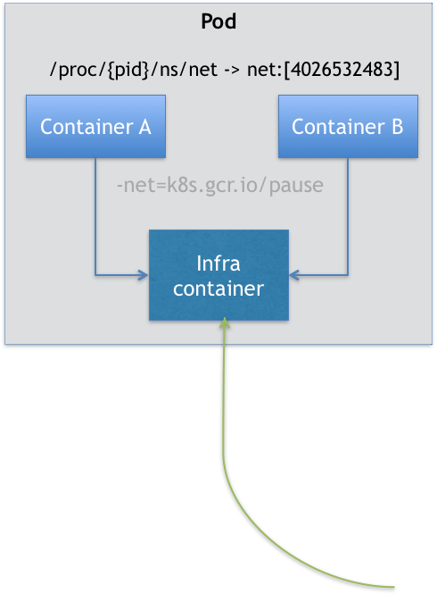

# pod

是 Kubernetes 项目的原子调度单位，如果k8s是操作系统，那pod就是虚拟机。

pod里能运行多个容器，**多个容器共享同一个网络，还可以声明共享同一个volume。**

每个pod都运行一个Pause的基础容器，用作共享网络和挂载卷；其他容器都以业务容器，共享pause容器的网络和挂载。



## 开发容器网络插件的注意点

如果要为 Kubernetes 开发一个网络插件时，不是关注每一个用户容器如何使用你的网络配置，这是没有意义的。

应该重点考虑的是如何配置这个 Pod 的 `Network Namespace`。

如果你的网络插件需要在容器里安装某些包或者配置才能完成的话，是不可取的：Infra 容器镜像的 rootfs 里几乎什么都没有，没有你随意发挥的空间。

当然，这同时也意味着你的网络插件完全不必关心用户容器的启动与否，而只需要关注如何配置 Pod，也就是 Infra 容器的 Network Namespace 即可。

## 如何共享volume

Kubernetes 项目只要把所有 `Volume` 的定义都**设计在 Pod 层级**即可。

在Pod里面，定义所有的volume

一个 Volume 对应的宿主机目录对于 Pod 来说就只有一个，Pod 里的容器只要声明挂载这个 Volume，就一定可以共享这个 Volume 对应的宿主机目录


```yaml
apiVersion: v1
kind: Pod
metadata:
  name: two-containers
spec:
  restartPolicy: Never
  volumes:
  - name: shared-data
    hostPath:      
      path: /data
  containers:
  - name: nginx-container
    image: nginx
    volumeMounts:
    - name: shared-data
      mountPath: /usr/share/nginx/html
  - name: debian-container
    image: debian
    volumeMounts:
    - name: shared-data
      mountPath: /pod-data
    command: ["/bin/sh"]
    args: ["-c", "echo Hello from the debian container > /pod-data/index.html"]
```

这个pod里面有两个容器 debian-container 和 nginx-container 

pod声明挂载了 shared-data 这个 hostPath 类型的Volume，hostPath对应在宿主机上的目录就是：/data

而两个容器都绑定挂载了 shared-data ，即nginx-container 的/usr/share/nginx/html 和debian-container 的/pod-data 实际是同一个目录

因此，nginx-container 可以从它的 /usr/share/nginx/html 目录中，读取到 debian-container 生成的 index.html 文件

