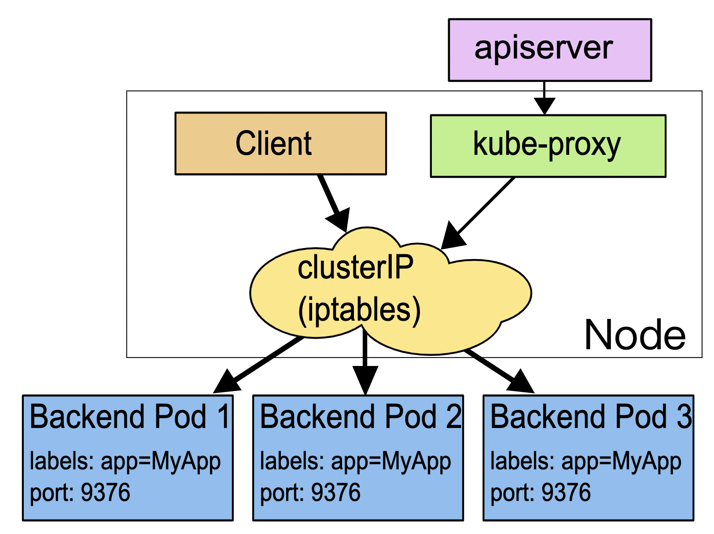

# yaml文件

k8s希望你用`YAML` 文件的方式，即：把容器的定义、参数、配置，统统记录在一个**声明式**的 YAML 文件中，然后用这样一句指令把它运行/删除起来：
```bash
kubectl apply/delete -f xxx.yml
```

基本字段

apiVersion、kind、metadata 都被 kubectl 用于生成 HTTP 请求发给 apiserver，比如


```yaml
https://192.168.49.2:8443/api/v1/namespaces/default/pods/ngx-pod
```


## pod
apiVersion一定是v1
kind一定是Pod

一个简单的pod，重要的是metadata里两个字段：
- name ：建议定义name加上`-pod`后缀区分其他API对象
- labels ：可以添加任意数量的key-value。结合name方便管理

```yaml
apiVersion: v1
kind: Pod
metadata:
  name: busy-pod
  labels:
    owner: chrono
    env: demo
    region: north
    tier: back
```

pod的yaml文件中最重要的字段是`containers`（name,image）,它里面有：

 - port 容器对外暴露的端口
 - imagePullPoliy 镜像拉取策略Always/Never/IfNotPresent，一般默认是 IfNotPresent（本地没有就去拉）
 - env pod环境变量，运行时指定
 - command 启动时执行的命令，相当于dockerfile的ENTRYPOINT
 - args command运行时的参数，相当于dockerfile的CMD

```yml
...
spec:
  containers:
  - image: busybox:latest
    name: busy
    imagePullPolicy: IfNotPresent
    env:
      - name: os
        value: "ubuntu"
      - name: debug
        value: "on"
    command:
      - /bin/echo
    args:
      - "$(os), $(debug)"
```
上面这个pod作用就是打印env的两个name而已

## job/cronjob

基于面向对象的设计思路：一个是“单一职责”，另一个是“组合优于继承”。

job 和 CronJob，它们就组合了 Pod，实现了对离线业务的处理。

在线任务：Nginx、Node.js、MySQL、Redis 等。不会停，交给pod

离线任务：日志分析、数据建模、视频转码等。总有停的时候

- 临时任务：job
- 定时任务：cronjob


### job
apiVersion一定是batch/v1
kind一定是Jod

> pod之外的yaml，再加上对象的类型名能**生成模板yaml文件**

```bash
export out="--dry-run=client -o yaml"              # 定义Shell变量
kubectl create job echo-job --image=busybox $out
```
```yml
apiVersion: batch/v1
kind: Job
metadata:
  name: echo-job

spec:
  template:
    spec:
      restartPolicy: OnFailure
      containers:
      - image: busybox
        name: echo-job
        imagePullPolicy: IfNotPresent
        command: ["/bin/echo"]
        args: ["hello", "world"]
```

在 Job 对象里应用了组合模式，`template` 字段定义了一个“应用模板”，里面嵌入了一个 Pod，这样 Job 就可以从这个模板来创建出 Pod。

而这个 Pod 因为受 Job 的管理控制，不直接和 `apiserver` 打交道，也就没必要重复 `apiVersion` 等“头字段”，只需要定义好关键的 spec，描述清楚容器相关的信息就可以了，可以说是一个“无头”的 Pod 对象。


apply运行之后，里面的pod就是打印helloworld而已。Job 业务的特殊性，所以我们还要在 spec 里多加一个字段 restartPolicy，确定 Pod 运行失败时的策略，OnFailure 是失败原地重启容器，而 Never 则是不重启容器，让 Job 去重新调度生成一个新的 Pod。

`kubectl get job`可以看到，因为 Pod 被 Job 管理，它就不会反复重启报错了，而是会显示为 Completed 表示任务完成，而 Job 里也会列出运行成功的作业数量，这里只有一个作业，所以就是 1/1。


`kubectl get pob`可以看到，Pod 被自动关联了一个名字，用的是 Job 的名字（echo-job）再加上一个随机字符串（pb5gh），这当然也是 Job 管理的“功劳”，免去了我们手工定义的麻烦，这样我们就可以使用命令 `kubectl logs` 来获取 Pod 的运行的hello world结果


> 下面的job例子展示`job`更牛逼的优势

创建一个 Job 对象，名字叫“sleep-job”，它随机睡眠一段时间再退出，模拟运行时间较长的作业（比如 MapReduce）。Job 的参数设置成 15 秒超时，最多重试 2 次，总共需要运行完 4 个 Pod，但同一时刻最多并发 2 个 Pod：

```yaml
apiVersion: batch/v1
kind: Job
metadata:
  name: sleep-job

spec:
  activeDeadlineSeconds: 15 #设置 Pod 运行的超时时间。
  backoffLimit: 2 #设置 Pod 的失败重试次数。
  completions: 4 #Job 完成需要运行多少个 Pod，默认是 1
  parallelism: 2 #它与 completions 相关，表示允许并发运行的 Pod 数量，避免过多占用资源。

  template:
    spec:
      restartPolicy: OnFailure
      containers:
      - image: busybox
        name: echo-job
        imagePullPolicy: IfNotPresent
        command:
          - sh
          - -c
          - sleep $(($RANDOM % 10 + 1)) && echo done
```

惯例apply运行之后，这次通过`kubectl get po -w`持续观察看到 Pod 不断被排队、创建、运行的过程:


等到 4 个 Pod 都运行完毕，我们再用 kubectl get 来看看 Job 和 Pod 的状态：


### cronjob
apiVersion一定是batch/v1
kind一定是CronJob

生成cj的模板yaml文件

```bash
export out="--dry-run=client -o yaml"              # 定义Shell变量
kubectl create cj echo-cj --image=busybox --schedule="" $out
```
```yaml
apiVersion: batch/v1
kind: CronJob
metadata:
  name: echo-cj

spec:
  schedule: '*/1 * * * *'
  jobTemplate:
    spec:
      template:
        spec:
          restartPolicy: OnFailure
          containers:
          - image: busybox
            name: echo-cj
            imagePullPolicy: IfNotPresent
            command: ["/bin/echo"]
            args: ["hello", "world"]
```

好家伙三个spec嵌套，其实不难：

- 第一个 spec 是 CronJob 自己的对象规格声明
- 第二个 spec 从属于“jobTemplate”，它定义了一个 Job 对象。
- 第三个 spec 从属于“template”，它定义了 Job 里运行的 Pod。


除了定义 Job 对象的“jobTemplate”字段之外，CronJob 还有一个新字段就是“schedule”，用来定义任务周期运行的规则。

类比crontab定时任务的用法，指定分钟、小时、天、月、周，和 Linux 上的 crontab 是一样的。

apply运行之后，使用 `kubectl get cj、kubectl get pod` 来查看状态：


## ConfigMap/Secret

### ConfigMap

k8s中专门管理配置信息的对象：
- ConfigMap 保存明文配置
- Secret 保存秘密配置

因为 ConfigMap 存储的是配置数据，是静态的字符串，并不是容器，所以它们就不需要用“spec”字段来说明运行时的“规格”。

生成带有“data”字段的 YAML 样板，你需要在 kubectl create 后面多加一个参数 --from-literal ，表示从字面值生成一些数据

因为在 ConfigMap 里的数据都是 Key-Value 结构，所以 --from-literal 参数需要使用 k=v 的形式。
```bash
export out="--dry-run=client -o yaml"
kubectl create cm info --from-literal=k=v $out
```
```yaml
apiVersion: v1
kind: ConfigMap
metadata:
  name: info

data:
  count: '10'
  debug: 'on'
  path: '/etc/systemd'
  greeting: |
    say hello to kubernetes.
```

apply运行之后，`kubectl get cm`，`kubectl describe cm info`查看


### Secret

创建 YAML 样板的命令是 kubectl create secret generic ，同样，也要使用参数 --from-literal 给出 Key-Value 值：

```bash
export out="--dry-run=client -o yaml"
kubectl create secret generic user --from-literal=name=root $out
```

```yml
apiVersion: v1
kind: Secret
metadata:
  name: user

data:
  name: cm9vdA==
```

看不到name的明文值，是因为做了 Base64 编码，linux本身可以通过下面这样进行 Base64 编码：

```bash
echo -n "123456" | base64
MTIzNDU2
```

然后就能自己添加数据

```yml
apiVersion: v1
kind: Secret
metadata:
  name: user

data:
  name: cm9vdA==  # root
  pwd: MTIzNDU2   # 123456
  db: bXlzcWw=    # mysql
```

apply之后，查看，data数据不会显示明文，只是显示大小信息


### 如何使用/注入配置信息对象

两种方法：
- Env 环境变量
- Volume 加载文件

#### Env

pod的containers字段里的env，就是环境变量，pod.spec.containers.env.valueFrom来指定环境变量值的来源：
- configMapKeyRef
- secretKeyRef

然后你要再进一步指定应用的 ConfigMap/Secret 的“name”和它里面的“key”，要当心的是这个“name”字段是 API 对象的名字，而不是 Key-Value 的名字。

下面是pod示范

```yaml
apiVersion: v1
kind: Pod
metadata:
  name: env-pod

spec:
  containers:
  - env:
      - name: COUNT 
        valueFrom:
          configMapKeyRef:
            name: info # API对象
            key: count # kv的key名
      - name: GREETING # kv的key名
        valueFrom:
          configMapKeyRef:
            name: info # API对象
            key: greeting # kv的key名
      - name: USERNAME
        valueFrom:
          secretKeyRef:
            name: user # API对象
            key: name # kv的key名
      - name: PASSWORD
        valueFrom:
          secretKeyRef:
            name: user # API对象
            key: pwd # kv的key名

    image: busybox
    name: busy
    imagePullPolicy: IfNotPresent
    command: ["/bin/sleep", "300"]
```


apply之后，exec进入pod，通过echo查看配置是否注入成功

```bash
kubectl apply -f env-pod.yml
kubectl exec -it env-pod -- sh

echo $COUNT
echo $GREETING
echo $USERNAME $PASSWORD
```


#### Volume

在 Pod 里挂载 Volume 很容易，只需要在“spec”里增加一个“volumes”字段，然后再定义卷的名字和引用的 ConfigMap/Secret 就可以了。

要注意的是 **`Volume` 属于 Pod，不属于容器**，所以它和字段`containers`是同级的，都属于“spec”。

```yml
spec:
  volumes:
  - name: cm-vol
    configMap:
      name: info
  - name: sec-vol
    secret:
      secretName: user
```

有了 Volume 的定义之后，就可以在容器里挂载了，这要用到“volumeMounts”字段，正如它的字面含义，可以把定义好的 Volume 挂载到容器里的某个路径下，所以需要在里面用“mountPath”“name”明确地指定挂载路径和 Volume 的名字。

```yml
  containers:
  - volumeMounts:
    - mountPath: /tmp/cm-items
      name: cm-vol
    - mountPath: /tmp/sec-items
      name: sec-vol
```

把“volumes”和“volumeMounts”字段都写好之后，配置信息就可以加载成文件了。


对比env环境变量是直接引用了 ConfigMap/Secret，而 Volume 又多加了一个环节，需要先用 Volume 引用 ConfigMap/Secret，然后在容器里挂载 Volume，有点“兜圈子”“弯弯绕”。

这种方式的好处在于：以 Volume 的概念统一抽象了所有的存储，不仅现在支持 ConfigMap/Secret，以后还能够支持临时卷、持久卷、动态卷、快照卷等许多形式的存储，扩展性非常好。

完整的pod的yml文件

```yml
apiVersion: v1
kind: Pod
metadata:
  name: vol-pod

spec:
  volumes:
  - name: cm-vol
    configMap:
      name: info
  - name: sec-vol
    secret:
      secretName: user

  containers:
  - volumeMounts:
    - mountPath: /tmp/cm-items
      name: cm-vol
    - mountPath: /tmp/sec-items
      name: sec-vol

    image: busybox
    name: busy
    imagePullPolicy: IfNotPresent
    command: ["/bin/sleep", "300"]
```

apply之后

```bash
kubectl get pod
kubectl exec -it vol-pod -- sh
```


ConfigMap 和 Secret 都变成了目录的形式，而它们里面的 Key-Value 变成了一个个的文件，而文件名就是 Key。

#### 总结

以 Volume 的方式来使用 ConfigMap/Secret，就和环境变量不太一样。环境变量用法简单，更适合存放简短的字符串，而 Volume 更适合存放大数据量的配置文件，在 Pod 里加载成文件后让应用直接读取使用。

## deployment

创建deploy模板文件

```bash
export out="--dry-run=client -o yaml"
kubectl create deploy ngx-dep --image=nginx:alpine $out
```

```yml
apiVersion: apps/v1
kind: Deployment
metadata:
  labels:
    app: ngx-dep
  name: ngx-dep
  
spec:
  replicas: 2 # pod副本数量
  selector:
    matchLabels: # 要被管理的pod的label匹配规则
      app: ngx-dep # 命令行要写成 app=ngx-dep
      
  template: # pod模板
    metadata:
      labels:
        app: ngx-dep # 要与上面模板pod的label匹配规则一致
    spec:
      containers:
      - image: nginx:alpine
        name: nginx
```


### 应用伸缩，弹性扩容

apply之后，相对pod进行增减扩容，执行下面的命令

```bash
kubectl scale --replicas=5 deploy ngx-dep
```

有了deployment 的label匹配pod，就能根据label查找pod了

```bash
kubectl get po -l app=ngx
kubectl get po -l 'app in (nginx, ngx, ngx-dep)'
```

## DaemonSet

弥补Deployment不能在固定节点部署的不足

在集群的每个节点都有且仅有一个pod运行，作用如守卫一样，看紧每个节点

因为不能通过命令生成模板，所有可以[参考官网模板例子](https://kubernetes.io/zh-cn/docs/concepts/workloads/controllers/daemonset/)

```yml
apiVersion: apps/v1
kind: DaemonSet
metadata:
  name: redis-ds
  labels:
    app: redis-ds

spec:
  selector:
    matchLabels:
      name: redis-ds

  template:
    metadata:
      labels:
        name: redis-ds
    spec:
      containers:
      - image: redis:5-alpine
        name: redis
        ports:
        - containerPort: 6379
```

DaemonSet 仅仅是在 Pod 的部署调度策略上和 Deployment 不同，其他的都是相同的


所以可以通过创建deployment模板的方式间接创建daemonset模板，参考上一节，这里不展示了

### taint 污点

“污点”是 Kubernetes 节点的一个属性，它的作用也是给节点“贴标签”，但为了不和已有的 labels 字段混淆，就改成了 taint。

操作 Node 上的“污点”属性需要使用命令 `kubectl taint`，然后指定节点名、污点名和污点的效果，去掉污点要额外加上一个 `-` 。

比如要去掉 Master 节点的“NoSchedule”效果，就要用这条命令：

```bash
kubectl taint node master node-role.kubernetes.io/master:NoSchedule-
```

### toleration 容忍度

和“污点”相对的，就是 Pod 的“容忍度”，顾名思义，就是 Pod 能否“容忍”污点。

容忍度是从属于pod的，也就是说在 Job/CronJob、Deployment 里为它们管理的 Pod 也加上 tolerations，从而能够更灵活地调度应用。

给pod添加容忍度，使之可以在一定“污染”的节点上运行。

比如让 DaemonSet 里的 Pod 能够在 Master 节点上运行，容忍节点的 node-role.kubernetes.io/master:NoSchedule ：

```bash
...
tolerations:
- key: node-role.kubernetes.io/master
  effect: NoSchedule
  operator: Exists
```

### 静态pod

不受k8s的apiserver，scheduler管理，只受每个节点上的kubelet管理。

静态 Pod”的 YAML 文件默认都存放在节点的 /etc/kubernetes/manifests 目录下，它是 Kubernetes 的专用目录。


## service

Service 使用了 iptables 技术，每个节点上的 kube-proxy 组件自动维护 iptables 规则，客户不再关心 Pod 的具体地址，只要访问 Service 的固定 IP 地址，Service 就会根据 iptables 规则转发请求给它管理的多个 Pod，是典型的负载均衡架构。

Service 并不是只能使用 iptables 来实现负载均衡，它还有另外两种实现技术：性能更差的 userspace 和性能更好的 ipvs

它本质上就是一个由 kube-proxy 控制的四层负载均衡，在 TCP/IP 协议栈上转发流量

`Service` 本身是没有服务能力的，它只是一些 iptables 规则，真正配置、应用这些规则的实际上是节点里的 `kube-proxy` 组件。



创建service模板yml文件

```bash
export out="--dry-run=client -o yaml"
kubectl expose deploy ngx-dep --port=80 --target-port=80 $out
```

```yml
apiVersion: v1
kind: Service
metadata:
  name: ngx-svc
  
spec:
  selector:
    app: ngx-dep
    
  ports:
  - port: 80 # service的端口
    targetPort: 80 # pod的端口
    protocol: TCP
```


### 小改造

1. 定义一个nginx的pod的配置信息对象configMap

```yml
apiVersion: v1
kind: ConfigMap
metadata:
  name: ngx-conf

data:
  default.conf: |
    server {
      listen 80;
      location / {
        default_type text/plain;
        return 200
          'srv : $server_addr:$server_port\nhost: $hostname\nuri : $request_method $host $request_uri\ndate: $time_iso8601\n';
      }
    }
```

2. 在deployment的pod模板里面定义存储卷volumes，再通过volumeMunts将上面的配置文件加到nginx的pod的模板里

```yml
apiVersion: apps/v1
kind: Deployment
metadata:
  name: ngx-dep

spec:
  replicas: 2
  selector:
    matchLabels:
      app: ngx-dep

  template:
    metadata:
      labels:
        app: ngx-dep
    spec:
      volumes:
      - name: ngx-conf-vol
        configMap:
          name: ngx-conf

      containers:
      - image: nginx:alpine
        name: nginx
        ports:
        - containerPort: 80

        volumeMounts:
        - mountPath: /etc/nginx/conf.d
          name: ngx-conf-vol
```

### service的负载均衡方式

- clusterIP 默认  **集群内可以直接用service的名字+端口访问pod**
- ExternalName 云服务商提供
- LoadBalancer 云服务商提供
- NodePort 


> NodePort   
Service 除了会对后端的 Pod 做负载均衡之外，还会在集群里的每个节点上创建一个独立的端口，用这个端口对外提供服务

修改service的type字段，再apply运行即可

```yml
apiVersion: v1
...
spec:
  ...
  type: NodePort
```


由于会在每个节点都暴露同一个对外的端口，所以利用任一节点ip+对外的端口都能实现从外部访问pod


## ingress

Service把服务暴露到集群外部，就只能使用 NodePort 或者 LoadBalancer 这两种方式，而它们都缺乏足够的灵活性

ingress工作在七层的 HTTP/HTTPS 协议上的，有更多的高级路由条件，比如主机名、URI、请求头、证书等，也是集群流量总出入口


### ingress controller

Ingress 也只是一些 HTTP 路由规则的集合，相当于一份静态的描述文件，真正要把这些规则在集群里实施运行，还需要有另外一个东西，这就是 Ingress Controller

它的作用就相当于 Service 的 kube-proxy，能够读取、应用 Ingress 规则，处理、调度流量。

不过 Ingress Controller 要做的事情太多，与上层业务联系太密切，所以 Kubernetes 把 Ingress Controller 的实现交给了社区

### ingress yaml

创建模板yaml文件，要添加两个必要参数
- --class，指定 Ingress 从属的 Ingress Class 对象。
- --rule，指定路由规则，基本形式是“URI=Service”，也就是说是访问 HTTP 路径就转发到对应的 Service 对象，再由 Service 对象转发给后端的 Pod。

```bash
export out="--dry-run=client -o yaml"
kubectl create ing ngx-ing --rule="ngx.test/=ngx-svc:80" --class=ngx-ink $out
```

```yaml
apiVersion: networking.k8s.io/v1
kind: Ingress
metadata:
  name: ngx-ing  # ingress的名子，建议后缀还是写全ingress
spec:
  ingressClassName: ngx-ink  #对应参数 --class=ngx-ink 
  rules: # 这里将url的路由规则拆散，逐个匹配
  - host: ngx.test  # 主机名 对应参数 --rule="ngx.test/=ngx-svc:80"
    http:
      paths:
      - path: / # 匹配路径
        pathType: Exact # 路径的匹配方式：这里是精确匹配；前缀匹配是Prefix
        backend: #指定转发的service对象
          service:
            name: ngx-svc  # --rule="ngx.test/=ngx-svc:80"
            port:
              number: 80   # --rule="ngx.test/=ngx-svc:80"
```

### ingress class

ingress class是连接ingress和ingress controller的，所以yaml文件的spec里面要指定好ingress controller

```yml
apiVersion: networking.k8s.io/v1
kind: IngressClass
metadata:
  name: ngx-ink
spec:
  controller: nginx.org/ingress-controller
```


1. 现在有了Jenkins-service

2. 所以要创建jenkins-ingress.yaml

3. 再创建jenkins-ingressclass.yaml

4. 将jenkins-ingressclass配置到ingress-controller里面


1. 现在有了Jenkins-service  已运行
```yaml
apiVersion: v1
kind: Service
metadata:
  name: jenkins-service
spec:
  type: NodePort
  ports:
  - port: 8080 # service's port
    targetPort: 8080 # pod's port
  selector:
    app: jenkins
```

2. 所以要创建jenkins-ingress.yaml
```yaml
apiVersion: networking.k8s.io/v1
kind: Ingress
metadata:
  name: jenkins-ingress
spec:
  ingressClassName: jenkins-ingressclass
  rules:
  - host: ngx.test
    http:
      paths:
      - path: /
        pathType: Exact
        backend:
          service:
            name: jenkins-service
            port:
              number: 80
```

3. 系统本来的ingressclass    nginx
```yaml
apiVersion: networking.k8s.io/v1
kind: IngressClass
metadata:
  annotations:
    ingressclass.kubernetes.io/is-default-class: "true"
    kubectl.kubernetes.io/last-applied-configuration: |
      {"apiVersion":"networking.k8s.io/v1","kind":"IngressClass","metadata":{"annotations":{"ingressclass.kubernetes.io/is-default-class":"true"},"labels":{"app.kubernetes.io/component":"controller","app.kubernetes.io/instance":"ingress-nginx","app.kubernetes.io/name":"ingress-nginx","app.kubernetes.io/version":"1.2.0"},"name":"nginx"},"spec":{"controller":"k8s.io/ingress-nginx"}}
  creationTimestamp: "2022-10-12T02:45:13Z"
  generation: 1
  labels:
    app.kubernetes.io/component: controller
    app.kubernetes.io/instance: ingress-nginx
    app.kubernetes.io/name: ingress-nginx
    app.kubernetes.io/version: 1.2.0
  name: nginx
  resourceVersion: "817"
  uid: 027cb9be-404d-4147-a4d4-0d12967104b4
spec:
  controller: k8s.io/ingress-nginx
```