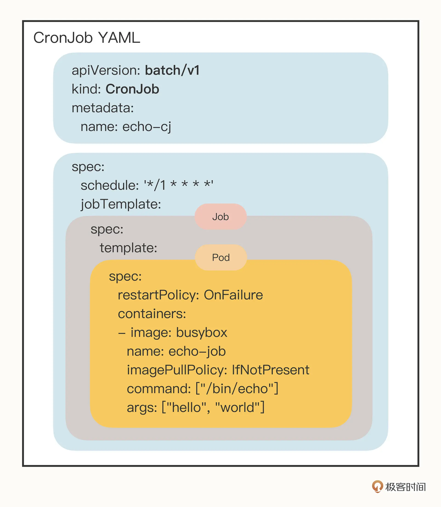

# yaml文件

k8s希望你用`YAML` 文件的方式，即：把容器的定义、参数、配置，统统记录在一个**声明式**的 YAML 文件中，然后用这样一句指令把它运行/删除起来：
```bash
kubectl apply/delete -f xxx.yml
```

基本字段

apiVersion、kind、metadata 都被 kubectl 用于生成 HTTP 请求发给 apiserver，比如


```yaml
https://192.168.49.2:8443/api/v1/namespaces/default/pods/ngx-pod
```


## pod
apiVersion一定是v1
kind一定是Pod

一个简单的pod，重要的是metadata里两个字段：
- name ：建议定义name加上`-pod`后缀区分其他API对象
- labels ：可以添加任意数量的key-value。结合name方便管理

```yaml
apiVersion: v1
kind: Pod
metadata:
  name: busy-pod
  labels:
    owner: chrono
    env: demo
    region: north
    tier: back
```

pod的yaml文件中最重要的字段是`containers`（name,image）,它里面有：

 - port 容器对外暴露的端口
 - imagePullPoliy 镜像拉取策略Always/Never/IfNotPresent，一般默认是 IfNotPresent（本地没有就去拉）
 - env pod环境变量，运行时指定
 - command 启动时执行的命令，相当于dockerfile的ENTRYPOINT
 - args command运行时的参数，相当于dockerfile的CMD

```yml
...
spec:
  containers:
  - image: busybox:latest
    name: busy
    imagePullPolicy: IfNotPresent
    env:
      - name: os
        value: "ubuntu"
      - name: debug
        value: "on"
    command:
      - /bin/echo
    args:
      - "$(os), $(debug)"
```
上面这个pod作用就是打印env的两个name而已

## job/cronjob

基于面向对象的设计思路：一个是“单一职责”，另一个是“组合优于继承”。

job 和 CronJob，它们就组合了 Pod，实现了对离线业务的处理。

在线任务：Nginx、Node.js、MySQL、Redis 等。不会停，交给pod

离线任务：日志分析、数据建模、视频转码等。总有停的时候

- 临时任务：job
- 定时任务：cronjob


### job
apiVersion一定是batch/v1
kind一定是Jod

> pod之外的yaml，再加上对象的类型名能**生成模板yaml文件**

```bash
export out="--dry-run=client -o yaml"              # 定义Shell变量
kubectl create job echo-job --image=busybox $out
```
```yml
apiVersion: batch/v1
kind: Job
metadata:
  name: echo-job

spec:
  template:
    spec:
      restartPolicy: OnFailure
      containers:
      - image: busybox
        name: echo-job
        imagePullPolicy: IfNotPresent
        command: ["/bin/echo"]
        args: ["hello", "world"]
```

在 Job 对象里应用了组合模式，`template` 字段定义了一个“应用模板”，里面嵌入了一个 Pod，这样 Job 就可以从这个模板来创建出 Pod。

而这个 Pod 因为受 Job 的管理控制，不直接和 `apiserver` 打交道，也就没必要重复 `apiVersion` 等“头字段”，只需要定义好关键的 spec，描述清楚容器相关的信息就可以了，可以说是一个“无头”的 Pod 对象。


apply运行之后，里面的pod就是打印helloworld而已。Job 业务的特殊性，所以我们还要在 spec 里多加一个字段 restartPolicy，确定 Pod 运行失败时的策略，OnFailure 是失败原地重启容器，而 Never 则是不重启容器，让 Job 去重新调度生成一个新的 Pod。

`kubectl get job`可以看到，因为 Pod 被 Job 管理，它就不会反复重启报错了，而是会显示为 Completed 表示任务完成，而 Job 里也会列出运行成功的作业数量，这里只有一个作业，所以就是 1/1。


`kubectl get pob`可以看到，Pod 被自动关联了一个名字，用的是 Job 的名字（echo-job）再加上一个随机字符串（pb5gh），这当然也是 Job 管理的“功劳”，免去了我们手工定义的麻烦，这样我们就可以使用命令 `kubectl logs` 来获取 Pod 的运行的hello world结果


> 下面的job例子展示`job`更牛逼的优势

创建一个 Job 对象，名字叫“sleep-job”，它随机睡眠一段时间再退出，模拟运行时间较长的作业（比如 MapReduce）。Job 的参数设置成 15 秒超时，最多重试 2 次，总共需要运行完 4 个 Pod，但同一时刻最多并发 2 个 Pod：

```yaml
apiVersion: batch/v1
kind: Job
metadata:
  name: sleep-job

spec:
  activeDeadlineSeconds: 15 #设置 Pod 运行的超时时间。
  backoffLimit: 2 #设置 Pod 的失败重试次数。
  completions: 4 #Job 完成需要运行多少个 Pod，默认是 1
  parallelism: 2 #它与 completions 相关，表示允许并发运行的 Pod 数量，避免过多占用资源。

  template:
    spec:
      restartPolicy: OnFailure
      containers:
      - image: busybox
        name: echo-job
        imagePullPolicy: IfNotPresent
        command:
          - sh
          - -c
          - sleep $(($RANDOM % 10 + 1)) && echo done
```

惯例apply运行之后，这次通过`kubectl get po -w`持续观察看到 Pod 不断被排队、创建、运行的过程:


等到 4 个 Pod 都运行完毕，我们再用 kubectl get 来看看 Job 和 Pod 的状态：


### cronjob
apiVersion一定是batch/v1
kind一定是CronJob

生成cj的模板yaml文件

```bash
export out="--dry-run=client -o yaml"              # 定义Shell变量
kubectl create cj echo-cj --image=busybox --schedule="" $out
```
```yaml
apiVersion: batch/v1
kind: CronJob
metadata:
  name: echo-cj

spec:
  schedule: '*/1 * * * *'
  jobTemplate:
    spec:
      template:
        spec:
          restartPolicy: OnFailure
          containers:
          - image: busybox
            name: echo-cj
            imagePullPolicy: IfNotPresent
            command: ["/bin/echo"]
            args: ["hello", "world"]
```

好家伙三个spec嵌套，其实不难：

- 第一个 spec 是 CronJob 自己的对象规格声明
- 第二个 spec 从属于“jobTemplate”，它定义了一个 Job 对象。
- 第三个 spec 从属于“template”，它定义了 Job 里运行的 Pod。



除了定义 Job 对象的“jobTemplate”字段之外，CronJob 还有一个新字段就是“schedule”，用来定义任务周期运行的规则。

类比crontab定时任务的用法，指定分钟、小时、天、月、周，和 Linux 上的 crontab 是一样的。

apply运行之后，使用 `kubectl get cj、kubectl get pod` 来查看状态：


## deployment

```yml
apiVersion: apps/v1
kind: Deployment
metadata:
  name: nginx-deployment
spec:
  selector:
    matchLabels:
      app: nginx
  replicas: 2
  template:
    metadata:
      labels:
        app: nginx
    spec:
      containers:
      - name: nginx
        image: nginx:1.7.9
        ports:
        - containerPort: 80
```


## service
```yml

```


## 
```yml

```