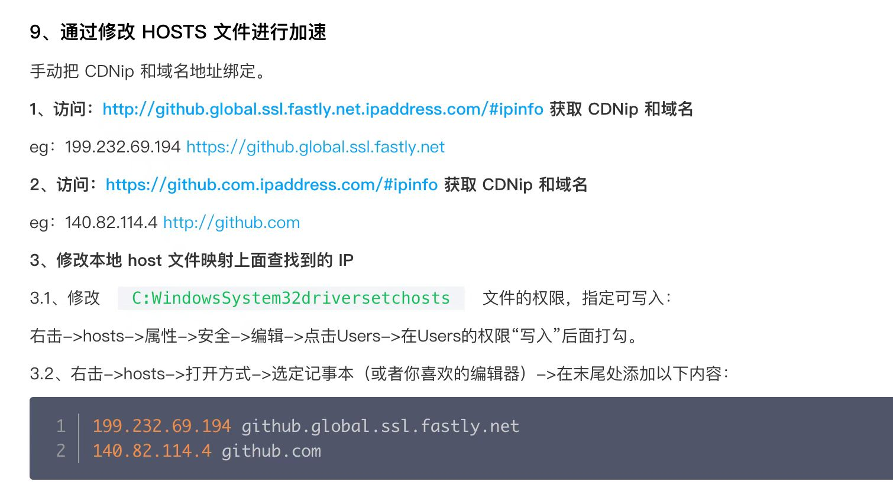

# git push/pull总是超时怎么办

> Q: 

相信各位经常在`git pull/push`遇到代码同步远程仓库的问题，尤其是当仓库在`github`的时候。连接超时的问题总是困扰着大家。很多伙伴即使已经使用了科学上网的方式之后，依然频出超时问题


> A:
集思广益之后，总结出以下几种解决方案：

1. [macOS 给 Git(Github) 设置代理（HTTP/SSH）](https://gist.github.com/chuyik/02d0d37a49edc162546441092efae6a1)
2. git加速
3. 
4. 

## 给github设置http/ssh代理
### macOS
- http形式
```
# http
git config --global http.proxy "http://127.0.0.1:8080"
git config --global https.proxy "http://127.0.0.1:8080"
# socks5
git config --global http.proxy "socks5://127.0.0.1:1080"
git config --global https.proxy "socks5://127.0.0.1:1080"
# 取消设置
git config --global --unset http.proxy
git config --global --unset https.proxy
```

- ssh形式
修改 ~/.ssh/config 文件（不存在则新建）：
```
# 必须是 github.com
Host github.com
   HostName github.com
   User git
   # 走 HTTP 代理
   # ProxyCommand socat - PROXY:127.0.0.1:%h:%p,proxyport=8080
   # 走 socks5 代理（如 Shadowsocks）
   # ProxyCommand nc -v -x 127.0.0.1:1080 %h %p
```

### Windows
```
ProxyCommand connect -S 127.0.0.1:1080 -a none %h %p

Host github.com
  User git
  Port 22
  Hostname github.com
  # 注意修改路径为你的路径
  IdentityFile "C:\Users\luche\.ssh\id_rsa"
  TCPKeepAlive yes

Host ssh.github.com
  User git
  Port 443
  Hostname ssh.github.com
  # 注意修改路径为你的路径
  IdentityFile "C:\Users\luche\.ssh\id_rsa"
  TCPKeepAlive yes
  ```

 > 使用Clash
```
# github
Host *github.com
  PreferredAuthentications publickey
  IdentityFile ~/.ssh/id_rsa
  ProxyCommand connect -S 127.0.0.1:7890 -a none %h %p
```

## git加速



1. 访问[这里](https://github.global.ssl.fastly.net.ipaddress.com/#ipinfo)，获取CDNip和域名
eg: 140.82.114.4 http://github.com
2. 再访问[这里](https://github.com.ipaddress.com/#ipinfo)，获取CDNip和域名
eg: 140.82.114.4 http://github.com
3. 管理员身份修改本地host文件，映射上面查找到的IP
Windows：c:Windows-System32-drivers-etc-hosts
在最后添加：
```
151.101.1.194		github.global.ssl.fastly.net
151.101.65.194		github.global.ssl.fastly.net
151.101.129.194		github.global.ssl.fastly.net
151.101.193.194		github.global.ssl.fastly.net

140.82.113.4 		github.com
```
