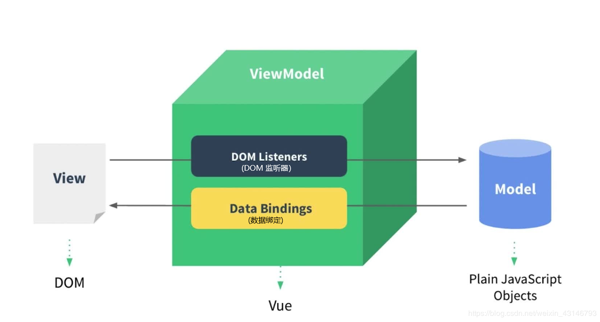

# vue

# 什么是MVVM模式

MVVM模式：
- M model，数据模型
- V即 view，视图
- VM即 view-model，视图模型



理解：后台数据通过`VM`来渲染`V`，就是页面。当用户在页面上进行操作的时候， `VM`会自动监听到用户的操作，从而修改`M`改变后台数据。

> 正式开始vue

[在线10分钟跟着录屏就能学vue基础](https://scrimba.com/learn/vuedocs)

[vue2中文官网地址](https://v2.cn.vuejs.org/v2/guide/#%E8%B5%B7%E6%AD%A5)

推荐直接从vue2开始学，再一步步找项目练手

## vue实例关联DOM元素
```html
<div id="app">
  {{ message }}
</div>
```
```javascript
var app = new Vue({
  el: '#app',
  data: {
    message: 'Hello Vue!'
  }
})
```
vue实例就是通过`el`属性（property），作为`id`选择器，去关联`id`为`app`的DOM

vue实例里面的`data`属性用于保存数据，用于给DOM视图中声明的变量进行赋值

动手尝试：
视图里面div中添加`{{name}}`变量，然后在vue的data属性中进行赋值`name: 'this is vue'`,

## v-bind指令说明

> v-bind:attribute和:attribute作用是一样的，后者是前者是缩写

```html
<div id="app-2">
  <span v-bind:title="message">
    鼠标悬停几秒钟查看此处动态绑定的提示信息！
  </span>
</div>

<div id="app-2">
  <span :title="message">
    鼠标悬停几秒钟查看此处动态绑定的提示信息！
  </span>
</div>
```
```javascript
var app2 = new Vue({
  el: '#app-2',
  data: {
    message: '页面加载于 ' + new Date().toLocaleString()
  }
})
```
`v-bind:attribute="xxx"`或者`:attribute="xxx"`

通过`v-bind`指令，将`span`元素的`title`属性（attribute），与下面vue实例的`message`属性（property），绑定在一起。

之后在js控制台输入`app2.message='yyy'`，就会看到html页面做出响应更新。


## v-for指令说明

```html
<ul>
  <li v-for="a in list">
    <span v-if="!a.del">{{a.title}}</span>
    <span v-else style="text-decoration: line-through">{{a.title}}</span>
    <button v-show="!a.del">delete</button>
  </li>
</ul>
```

```javascript
<script>
    var vm = new Vue({
        el: '#app',
        data: {
            message: 'hello hincky',
            list: [{
                title: '课程1',
                del: false
            },{
                title: '课程2',
                del: true
            }],
        }
    })
</script>
```
v-for指令在定义的时候就要定义清楚元素的名字

如果li标签里面是`v-for="a in list"`，`v-if`和`v-else`指令就用`a.del`和`a.title`去指代`list`的属性

如果li标签里面是`v-for="item in list"`，`v-if`和`v-else`指令就用`item.del`和`item.title`去指代`list`的属性

`v-for` 和 `v-if`，`v-else`并不一定是配套使用的，`v-if`，`v-else`可以单独使用

同样可以在`console`里面去修改具体dom属性的值，进行响应式查看

## 初识vue实例
这一部分建议对照[官网教程](https://v2.cn.vuejs.org/v2/guide/index.html#%E8%B5%B7%E6%AD%A5)的“起步”~“处理用户输入”章节，进行学习与理解

```javascript
< v-xxx:attribute="property"></>
```

```javascript
var app2 = new Vue({
  el: '#app-2',
  data: {
    property: 
  }
})
```

`v-xxx:attribute="property"`

v指令和属性
|v-xxx|条件|实例属性property|默认值|属性作用说明|
|:---|:---:|:---:|:---:|:---|
|v-bind或:|绑定|message|string|字符文本|
|v-if|条件|seen|true|是否可见|
|v-for|循环|todo|text|循环输出文本|
|v-on或@|监听事件|click|-|鼠标点击触发事件|
|v-model|表单输入|message|string|字符文本|
|v-|||||

# 组件系统

组件化构建系统：使用小型、独立和通常可复用的组件构建大型应用。


来看一下官网的例子：
1. 这样定义`todo-item`组件，使之能够接受一个 `prop`，父作用域将数据传到子组件。
```javascript
Vue.component('todo-item', {
  // todo-item 组件现在接受一个
  // "prop"，类似于一个自定义 attribute。
  // 这个 prop 名为 todo。
  props: ['todo'],
  template: '<li>{{ todo.text }}</li>'
})
```
2. 再使用 `v-bind` 指令将待办项传到循环输出的每个组件中：
```html
<div id="app-7">
  <ol>
    <!--
      现在我们为每个 todo-item 提供 todo 对象
      todo 对象是变量，即其内容可以是动态的。
      我们也需要为每个组件提供一个“key”，稍后再
      作详细解释。
    -->
    <todo-item
      v-for="item in groceryList"
      v-bind:todo="item"
      v-bind:key="item.id"
    ></todo-item>
  </ol>
</div>
```
3. 最后注入数据
```javascript
Vue.component('todo-item', {
  props: ['todo'],
  template: '<li>{{ todo.text }}</li>'
})

var app7 = new Vue({
  el: '#app-7',
  data: {
    groceryList: [
      { id: 0, text: '蔬菜' },
      { id: 1, text: '奶酪' },
      { id: 2, text: '随便其它什么人吃的东西' }
    ]
  }
})
```
上面这个例子就是将应用分割成了两个更小的单元。子单元通过 `prop` 接口与父单元进行了良好的解耦。

在一个大型应用中，有必要将整个应用程序划分为组件，以使开发更易管理。下面就是使用了组件的应用模板：
```html
<div id="app">
  <app-nav></app-nav>
  <app-view>
    <app-sidebar></app-sidebar>
    <app-content></app-content>
  </app-view>
</div>
```

## 数据与方法
vm中前面的data是vm的属性，后面的data是用var定义的data对象形式变量

除了数据属性，vue还有实例属性和方法，用`$`表示，和用户定义的属性区分开；例子中的`$data`指的就是用var定义的data对象形式变量

所以`vm.a`作用等同于`vm.$data.a`

### watch使用

看到变量变化前后的值

```javascript
vm.$watch('变量名',function(newVal,oldVal){
  console.log(newVal,oldVal)
})
```

```html
html文件
...

<div id="app">
	{{a}}
</div>

<script type="text/javascript">
var data = { a : 1 };
var vm = new Vue({
	el   : "#app",
	data : data
});

vm.$watch('a', function(newVal, oldVal){
	console.log(newVal, oldVal);
})

vm.$data.a = "test...."

</script>

...

```

> 如果要让某对象不再响应式跟踪变化，利用`Object.freeze(obj)`

```javascript
var obj = {
  foo: 'bar'
}

Object.freeze(obj)
```

## 生命周期与钩子

[官网生命周期钩子API](https://v2.cn.vuejs.org/v2/api/#%E9%80%89%E9%A1%B9-%E7%94%9F%E5%91%BD%E5%91%A8%E6%9C%9F%E9%92%A9%E5%AD%90)

生命周期钩子需要以属性的方式写在`new Vue`对象里面，执行顺序
beforeCreate
created
beforeMount
mounted
beforeUpdate
updated

```html
html
...
<div id="app">
	{{msg}}
</div>
<script type="text/javascript">
var vm = new Vue({
	el : "#app",
	data : {
		msg : "hi vue",
	},
	//在实例初始化之后，数据观测 (data observer) 和 event/watcher 事件配置之前被调用。(也可以是整个页面创建之前)
	beforeCreate:function(){
		console.log('beforeCreate');
	},
	/* 在实例创建完成后被立即调用。
	在这一步，实例已完成以下的配置：数据观测 (data observer)，属性和方法的运算，watch/event 事件回调。
	然而，挂载阶段还没开始，$el 属性目前不可见。 */
	created	:function(){
		console.log('created');
	},
	//在挂载开始之前被调用：相关的渲染函数首次被调用
	beforeMount : function(){
		console.log('beforeMount');

	},
	//el 被新创建的 vm.$el 替换, 挂在成功	
	mounted : function(){
		console.log('mounted');
	
	},
	//数据更新时调用
	beforeUpdate : function(){
		console.log('beforeUpdate');
			
	},
	//组件 DOM 已经更新, 组件更新完毕 
	updated : function(){
		console.log('updated');
			
	}
});
setTimeout(function(){
	vm.msg = "change ......";
}, 3000);
</script>
...

```
