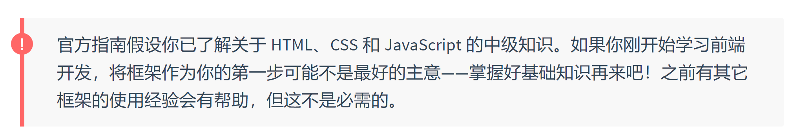
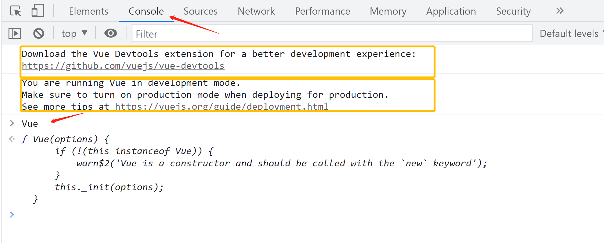

# Vue

从应用的广泛程度和学习曲线来说，建议用vue2开始学习，这里是[官方文档](https://cn.vuejs.org/v2/guide/)

## 带你读懂官方文档

如下这种是注意事项，官方文档里并不是所有的注意事项都要仔细阅读，自己斟酌即可



## 安装vue的方式 

> 本教程使用的是引入的方法

1. 在html文件中引入vue的cdn
创建一个`.html`文件，然后下面二者选一个引入
```html
<!-- 开发环境版本，包含了有帮助的命令行警告 -->
<script src="https://cdn.jsdelivr.net/npm/vue@2/dist/vue.js"></script>

<!-- 生产环境版本，优化了尺寸和速度 -->
<script src="https://cdn.jsdelivr.net/npm/vue@2"></script>
```

为避免引入出错，点击开发版本的cdn链接，将网页下载保存到本地，再引入到html中更为保险
将vue.js下载到新建的js文件夹

2. vue-cli 

3. Bower

更多参考[官方安装文档](https://v2.cn.vuejs.org/v2/guide/installation.html)

## 引入vue实践

1. vscode创建一个`hello.html`文件
2. 英文状态下输入`!`，按tab输出html模板
3. 引入vue.js，效果如下

```html
<!DOCTYPE html>
<html lang="en">
<head>
    <meta charset="UTF-8">
    <meta http-equiv="X-UA-Compatible" content="IE=edge">
    <meta name="viewport" content="width=device-width, initial-scale=1.0">
    <title>Document</title> 
</head>
<body>
    
</body>
<script src="./js/vue.js"></script>
</html>
```

### 验证是否引入成功
html按12打开控制台，console里面输入Vue有东西，效果如下



两个黄色的提示意思分别是：
1. 安装vue的浏览器开发者调试工具
2. 这个vue.js是开发版本，相对较大。建议生产环境使用生产版本的vue.js

[点击下载页面](https://devtools.vuejs.org/guide/installation.html)，选择对应的浏览器开发工具，添加到浏览器中

想去掉这两个提示信息，可以直接引入生产环境的vue.js一了百了；也可以安装好vue开发者工具，再设置vue全局配置，关掉生产信息提示
```html
<script type="text/javascript">
    Vue.config.productionTip = false
</script>
```


