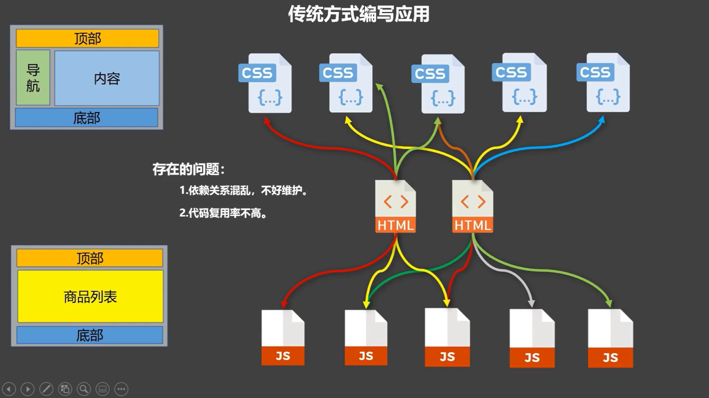
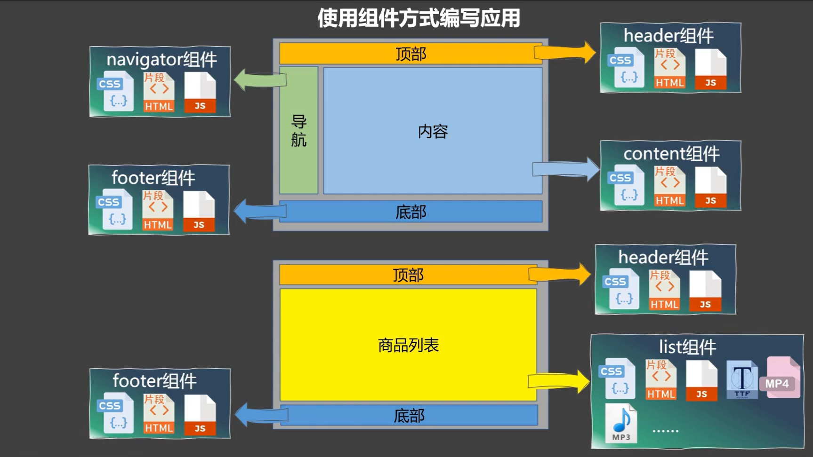

# 组件

## 模块与组件，模块化和组件化



模块
理解：向外提供特定功能的js程序，一般就是一个js文件
为什么：js文件很多很复杂
作用：复用，简化js编写，提高js效率

组件
定义：用来实现局部功能的代码和资源的集合
为什么：一个界面的功能很复杂
作用：复用编码，简化项目编码，提高运行效率

模块化
当应用中的js都以模块来编写，那这个应用就是模块化应用

组件化
当应用中的功能都是多组件的方式来编写，那这个应用就是组件化应用


## 非单文件组件

非单文件组件：一个文件包含n个组件
单文件组件：一个文件只包含1个组件

### 基本使用
1. 定义组件
2. 注册组件
3. 使用组件

> 进行下列步骤，要在html文件里面编写，然后浏览器再打开页面查看效果

#### 1. 定义组件 
使用`Vue.extend({options})`创建组件。
关键点：
- `el`不能写，因为最终所有的组件都要由一个vm管理，由vm里面的`el`才决定实例服务于哪个div容器
- `data`必须写成函数，避免组件被复用时，数据存在引用关系，导致A修改组件，而使用组件的B也被修改了

以函数的形式传入配置对象。options里面可以配置很多控制该组件的相关内容。
组件的一般写法：
```js
const componentName = Vue.extend({
    ...,
    data(){
        return {...}
    },
    ...
})
```
#### 2. 注册组件
- 局部注册组件：`new Vue()`的时候`options`传入`components`选项
- 全局注册组件：`Vue.component('componentName',组件)`
#### 3. 使用组件
编写组件标签，比如<school></school>

> 三个步骤完成后的整体效果

```html
<script type="text/javascript">
    Vue.config.productionTip=false
    

</script>
```


